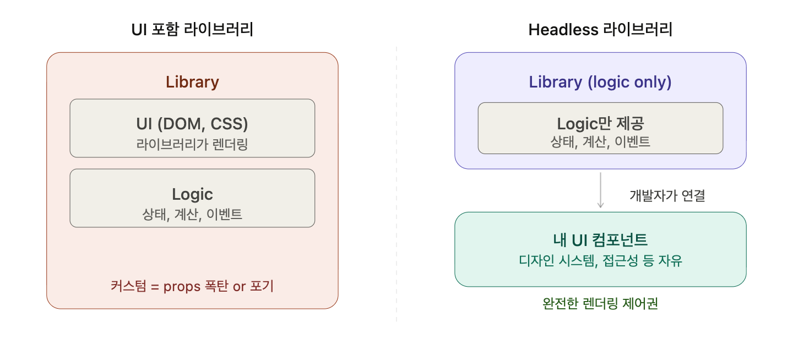
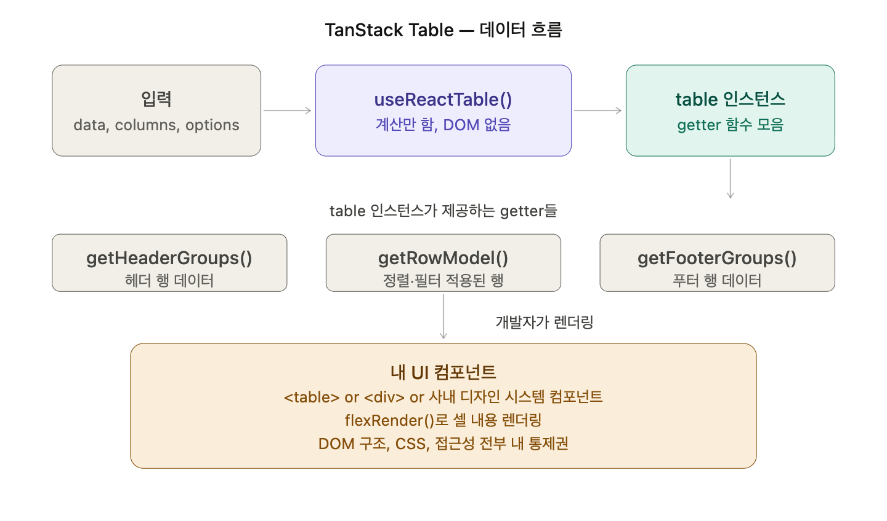
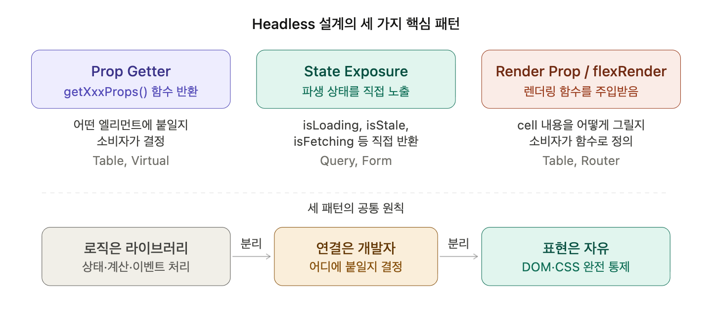

# 정의

## TanStack이란?

공식 문서 첫 화면에서 볼 수 있는 말은 아래와 같습니다.

> **High-quality open-source software for web developers.**
> Headless, type-safe, & powerful utilities for Web Applications, Routing, State Management, Data Visualization, Datagrids/Tables, and more.

즉, TanStack은 단순한 라이브러리 모음이 아니라, 프론트엔드 개발에서 반복되는 복잡한 **상태 관리와 UI 로직을 표준화**하려는 철학의 집합체입니다.

## TanStack 탄생 배경: Redux의 한계

기존에는 모든 데이터를 Redux같은 전역 상태 관리 도구에 넣었습니다. 하지만 여기서 “서버 데이터의 진짜 주인은 누구일까”라는 질문이 시작되었습니다.

진짜 주인은 서버 DB고, 웹은 그냥 복사본을 들고 있는 것과 같습니다. 즉, Redux는 이 **복사본**을 마치 웹이 영원히 소유하는 진짜 상태처럼 취급하기 때문에 아래와 같은 문제점들이 발생할 수 있습니다.

1. **stale한 데이터인지 감지 불가능**

```jsx
store = { user: { name: "claude", plan: "free" } };

// 다른 탭에서 유저가 plan을 'pro'로 업그레이드해도 Redux는 이걸 알 방법이 없음

const user = useSelector((state) => state.user);
user.plan; // 'free' ← 틀린 데이터인데 웹은 모름
```

2. **fetch를 해야하는 타이밍을 모두 결정해줘야하는 불편함**

예를 들어 컴포넌트가 마운트 될 때, 탭 포커스 시 등등 아래 코드의 예시와 같은 순간마다 직접 개발자가 데이터를 fetch 해줘야합니다.

```jsx
// 아래 케이스들을 전부 직접 구현해야 함

// 컴포넌트 마운트될 때
useEffect(() => {
  dispatch(fetchUser(userId));
}, [userId]);

// 탭 포커스 돌아왔을 때
useEffect(() => {
  const handler = () => dispatch(fetchUser(userId));
  window.addEventListener("focus", handler);
  return () => window.removeEventListener("focus", handler);
}, []);

// 네트워크 재연결됐을 때
useEffect(() => {
  const handler = () => dispatch(fetchUser(userId));
  window.addEventListener("online", handler);
  return () => window.removeEventListener("online", handler);
}, []);
```

## TanStack 주요 도구별 정의

TanStack에서 주로 사용되는 도구들은 아래와 같이 크게 4가지 요소로 나눌 수 있습니다.

- **Query:** 서버 상태(Server State)를 관리하고 캐싱하는 도구
- **Table:** 데이터 가공, 정렬, 필터링 등 테이블의 '뇌' 역할을 하는 로직 라이브러리
- **Virtual:** 수만 개의 데이터를 성능 저하 없이 보여주기 위한 가상화
- **Router:** 런타임 오타를 방지하는 100% 타입 안전(Type-safe) 라우팅 시스템

## Headless / Framework-agnostic

### [Headless UI란?](https://www.notion.so/01TanStack-32b8637fc4b280b48857ca7033d2d2a6?pvs=21)

공식 문서를 읽어보면 Headless UI의 정의와 이점에 대해 살펴볼 수 있습니다.

> **Headless UI** is a term for libraries and utilities that provide the logic, state, processing and API for UI elements and interactions, but **do not provide markup, styles, or pre-built implementations**.

즉, DOM이나 스타일 없이 오직 **동작 로직**만 제공하는 방식을 의미합니다.



### Framework-agnostic란?

특정 프레임워크(React, Vue 등)에 종속되지 않고 핵심 로직을 공유하는 설계를 의미합니다.

# 어떻게 사용하는지

## TanStack

UI는 직접 통제하고, 라이브러리를 통해 그 내부의 복잡한 로직만 수행할 수 있도록 설계되어있습니다. 즉, TanStack Query를 통해 **선언적 데이터 관리**가 가능해집니다.

### Query - Redux 서버 상태 분리 필요성

> 서버 상태는 클라이언트 상태가 아니다

예를 들어, 직접 `useEffect`로 페칭 로직을 짜는 대신, 상태(isLoading, data)를 구독하는 방식으로 사용할 수 있습니다.

```jsx
// Before: 개발자가 직접 관리
const [data, setData] = useState(null);
const [loading, setLoading] = useState(false);
const [error, setError] = useState(null);
useEffect(() => {
  /* fetch 로직 반복... */
}, [userId]);

// After: Query가 관리
const { data, isLoading, error } = useQuery({
  queryKey: ["user", userId],
  queryFn: () => fetchUser(userId),
  staleTime: 5 * 60 * 1000,
});
```

### Table - UI 종속 테이블의 커스텀 한계

> 테이블 UI에서 로직을 분리하자

```jsx
// 기존 방식 (UI 포함된 라이브러리)
<DataGrid
  columns={columns}
  rows={rows}
  // 스타일 커스텀? → props 폭탄
  headerClassName="my-header"
  rowClassName="my-row"
  cellClassName="my-cell"
/>
```

기존 테이블 라이브러리들 (`react-table` 이전 버전 포함, `ag-grid` 등)은 **UI까지 같이 제공**합니다.

```jsx
// TanStack Table
const table = useReactTable({
  data,
  columns,
  getCoreRowModel: getCoreRowModel(),
});

// 렌더링은 마음대로
return (
  <MyCustomTable>
    {table.getHeaderGroups().map((headerGroup) => (
      <MyTableRow key={headerGroup.id}>
        {headerGroup.headers.map((header) => (
          <MyTableHeader key={header.id}>
            {flexRender(header.column.columnDef.header, header.getContext())}
          </MyTableHeader>
        ))}
      </MyTableRow>
    ))}
  </MyCustomTable>
);
```

### Virtual - 대용량 리스트 성능 이슈

> "DOM 노드는 최소한으로"

가장 중요한 포인트는 세 가지입니다. **스크롤 컨테이너(Parent)**, **전체 높이를 가진 공간(Canva)**, 그리고 실제로 보여줄 items입니다.

```jsx
import { useVirtualizer } from "@tanstack/react-virtual";
import { useRef } from "react";

function VirtualList() {
  const parentRef = useRef < HTMLDivElement > null;

  // 1. 가상화 로직 설정 (계산기 생성)
  const rowVirtualizer = useVirtualizer({
    count: 10000, // 전체 아이템 개수
    getScrollElement: () => parentRef.current, // 스크롤이 일어나는 엘리먼트
    estimateSize: () => 35, // 각 아이템의 예상 높이 (px)
    overscan: 5, // 화면 밖 상하단에 미리 렌더링할 개수
  });

  return (
    // 2. 스크롤 컨테이너 (고정 높이와 overflow: auto 필수)
    <div
      ref={parentRef}
      style={{ height: "400px", overflow: "auto", border: "1px solid #ccc" }}
    >
      {/* 3. 전체 아이템 높이를 구현하는 공간 (스크롤바 크기 결정) */}
      <div
        style={{
          height: `${rowVirtualizer.getTotalSize()}px`,
          width: "100%",
          position: "relative",
        }}
      >
        {/* 4. 가상화된 아이템들만 렌더링 */}
        {rowVirtualizer.getVirtualItems().map((virtualItem) => (
          <div
            key={virtualItem.key}
            style={{
              position: "absolute", // 절대 좌표로 배치
              top: 0,
              left: 0,
              width: "100%",
              height: `${virtualItem.size}px`,
              transform: `translateY(${virtualItem.start}px)`, // 계산된 위치로 이동
            }}
          >
            아이템 index: {virtualItem.index}
          </div>
        ))}
      </div>
    </div>
  );
}
```

## Headless UI

라이브러리가 DOM을 직접 렌더링하지 않고, 대신 엘리먼트에 붙일 **Props를 반환하는 함수(Getter)**를 제공합니다.

```jsx
// TanStack Table 예시
const table = useReactTable({ data, columns, getCoreRowModel: getCoreRowModel() })

// 사용자는 라이브러리가 준 '기능'을 원하는 UI에 직접 바인딩함
<table className="my-design-system">
  {table.getHeaderGroups().map(headerGroup => (
    <tr {...headerGroup.getFooterGroupProps()}> {/* 로직과 UI의 결합 */}
      {headerGroup.headers.map(header => (
        <th>{flexRender(header.column.columnDef.header)}</th>
      ))}
    </tr>
  ))}
</table>
```

## Framework-agnostic

해당 개념은 사실 TanStack의 설계 방식이지 사용하는 개념에는 가깝지 않은 것처럼 이해를 했습니다.

# 왜 써야하는지

## TanStack

### 해결한 문제들

- stale-while-revalidate 캐싱 전략 (오래된 데이터 보여주면서 백그라운드에서 새 데이터 fetch)
- 중복 요청 제거 (deduplication)
- 낙관적 업데이트 패턴 표준화
- 백그라운드 리페칭 자동화

### 관심사 분리 (Separation of Concerns)

디자인이 바뀌면 UI 코드만 수정하고, 로직이 바뀌면 TanStack 설정만 수정하면 됩니다.

- **일반 라이브러리:** 디자인 커스텀을 위해 수많은 `props`를 넘겨야 함 (Props가 점점 증가함)
- **TanStack (Headless):** 디자인은 100% 개발자 권한이며, 로직만 라이브러리에서 가져옴

### 프레임워크로부터의 독립 (Framework-agnostic)

React가 18에서 19로 업데이트되어도 TanStack의 핵심 로직(Core)은 변하지 않습니다.

- **안정성:** 핵심 캐싱/계산 로직이 프레임워크와 분리되어 있어 버전 업데이트에 강함
- **검증된 로직:** 전 세계의 React, Vue, Svelte 개발자가 같은 Core 로직을 공유하여 버그 수정이 빠름

### Query - Redux 서버 상태 분리 필요성

> 서버 상태는 클라이언트 상태가 아니다

더 중요한 것은 바로 **캐싱 전략**이라 할 수 있습니다. 같은 `queryKey`로 여러 컴포넌트가 구독하면 네트워크 요청은 하나만 나가게 됩니다.

이외에도 탭 포커스 돌아오면 자동 리페치, 네트워크 재연결 시 자동 리페치 등을 Redux로 구현하려면 엄청난 보일러플레이트가 필요했던 기존의 문제를 해결했습니다.

### Table - UI 종속 테이블의 커스텀 한계

> 테이블 UI에서 로직을 분리하자

`react-window`, `react-virtualized` 같은 기존 솔루션도 있었는데, 문제는 역시 **UI 컴포넌트로 래핑**하게 되었습니다. TanStack Virtual은 **"가상화 계산 로직"만** 제공함

### Virtual - 대용량 리스트 성능 이슈

> "DOM 노드는 최소한으로"

10,000개의 리스트를 그냥 렌더링하면 DOM 노드도 10,000개가 생성됩니다. 이는 메모리 점유율을 높이고 스크롤 성능을 심각하게 저하시킵니다. `TanStack Virtual`을 쓰면 화면에 보이는 **10~20개의 노드만 유지**하므로 브라우저가 매우 가볍게 돌아갑니다.

```jsx
기존 방식:
┌─────────────────┐
│  Item 1  (DOM) │  ← 화면에 보임
│  Item 2  (DOM) │  ← 화면에 보임
│  Item 3  (DOM) │  ← 화면에 보임
│  ...            │
│  Item 99998 (DOM)│ ← 안 보임, 근데 존재
│  Item 99999 (DOM)│ ← 안 보임, 근데 존재
│  Item 100000(DOM)│ ← 안 보임, 근데 존재
└─────────────────┘

Virtual 방식:
┌─────────────────┐
│  Item 47 (DOM) │  ← 화면에 보이는 것만
│  Item 48 (DOM) │
│  Item 49 (DOM) │
│  [나머지는 absolute position으로 공간만 차지]
└─────────────────┘
```

이외에도 아이템마다 내용의 길이에 따라 높이가 다를 때(예: 피드 글, 댓글), 기존 도구들은 구현이 매우 까다로웠습니다. TanStack Virtual은 **실제 렌더링된 크기를 다시 측정**하여 위치를 재계산하는 기능을 기본 제공합니다.

### Router - React Router의 타입 불안전성

> 타입 안전한 라우팅이 왜 없지?

React Router의 치명적인 약점은 타입이 없더라도 실제로 존재하는 파라미터인지 아닌지를 구별하지 못한다는 점입니다.

```jsx
// React Router v6 - 타입이 없음
const { userId } = useParams(); // userId: string | undefined
// 근데 이게 실제로 존재하는 파라미터인지 TS가 모름

// 잘못된 경로로 navigate해도 컴파일 에러 없음
navigate("/users/proflie"); // 오타인데 에러 없음!
navigate("/users/" + userId + "/setting"); // setting이 아니라 settings인데...
```

TanStack Router는 파일 기반 라우팅으로 **라우트 트리 자체가 타입**이 됩니다.

```jsx
// TanStack Router
const link = <Link to="/users/$userId/settings" params={{ userId: "123" }} />;
//                   ^^^^^^^^^^^^^^^^^^^^^^^^^^^  타입 자동완성 + 오타 에러
```

즉, 존재하지 않는 경로로 `navigate`하면 **컴파일 에러**가 발생하는데, 런타임이 아닌 빌드 타임에 잡힙니다. 이러한 React Router가 해결 못한 부분을 해결해줍니다.

## Headless UI

- 소프트웨어 엔지니어링 원칙 중 Separation of Concerns(관심사 분리)가 있습니다.
  "하나의 모듈은 하나의 변경 이유만 가져야 한다"
- UI 컴포넌트 안에는 사실 두 가지 완전히 다른 관심사가 섞여 있습니다.
  - 기획이 바뀌면 로직을, 디자인이 바뀌면 UI를 바꿔줘야하는데 두 가지 요소가 하나의 컴포넌트에 섞여있으면 하나만 바꾸더라도 둘 다 깨질 수 있는 위험이 생김
- Headless가 아닌 패턴

  ```jsx
  // ✅ useDropdown.ts — 로직만, DOM 없음
  interface UseDropdownOptions<T> {
    options: T[]
    onChange?: (value: T) => void
  }

  function useDropdown<T>({ options, onChange }: UseDropdownOptions<T>) {
    const [isOpen, setIsOpen] = useState(false)
    const [selected, setSelected] = useState<T | null>(null)
    const [activeIndex, setActiveIndex] = useState(-1)
    const containerRef = useRef<HTMLElement | null>(null)

    // 외부 클릭 감지 — DOM 이벤트만, 렌더링 없음
    useEffect(() => {
      const handler = (e: MouseEvent) => {
        if (!containerRef.current?.contains(e.target as Node)) {
          setIsOpen(false)
        }
      }
      document.addEventListener('mousedown', handler)
      return () => document.removeEventListener('mousedown', handler)
    }, [])

    const handleKeyDown = (e: KeyboardEvent) => {
      const actions: Record<string, () => void> = {
        ArrowDown: () => setActiveIndex(i => Math.min(i + 1, options.length - 1)),
        ArrowUp:   () => setActiveIndex(i => Math.max(i - 1, 0)),
        Enter:     () => activeIndex >= 0 && handleSelect(options[activeIndex]),
        Escape:    () => setIsOpen(false),
      }
      actions[e.key]?.()
    }

    const handleSelect = (option: T) => {
      setSelected(option)
      onChange?.(option)
      setIsOpen(false)
      setActiveIndex(-1)
    }

    // ↓ 핵심: DOM 속성들을 "getter 함수"로 반환
    //   어떤 엘리먼트에 붙일지는 소비자가 결정
    return {
      isOpen,
      selected,
      activeIndex,
      // prop getter 패턴 — 이게 Headless의 핵심
      getContainerProps: () => ({
        ref: containerRef,
        onKeyDown: handleKeyDown,
      }),
      getTriggerProps: () => ({
        onClick: () => setIsOpen(o => !o),
        'aria-expanded': isOpen,
        'aria-haspopup': 'listbox' as const,
      }),
      getMenuProps: () => ({
        role: 'listbox',
      }),
      getItemProps: (index: number, option: T) => ({
        role: 'option',
        'aria-selected': index === activeIndex,
        onClick: () => handleSelect(option),
        onMouseEnter: () => setActiveIndex(index),
      }),
    }
  }
  ```

- Headless 패턴

  ```jsx
  // ✅ 기본 드롭다운 UI
  function MyDropdown({ options }) {
    const {
      isOpen,
      selected,
      activeIndex,
      getContainerProps,
      getTriggerProps,
      getMenuProps,
      getItemProps,
    } = useDropdown({ options });

    return (
      <div {...getContainerProps()}>
        <button {...getTriggerProps()}>
          {selected?.label ?? "선택하세요"}
        </button>
        {isOpen && (
          <ul {...getMenuProps()}>
            {options.map((option, i) => (
              <li
                key={option.value}
                style={{ background: i === activeIndex ? "#eee" : "white" }}
                {...getItemProps(i, option)}
              >
                {option.label}
              </li>
            ))}
          </ul>
        )}
      </div>
    );
  }

  // ✅ 완전히 다른 UI — 로직(useDropdown)은 그대로
  function CommandPaletteDropdown({ options }) {
    const {
      isOpen,
      activeIndex,
      getContainerProps,
      getTriggerProps,
      getMenuProps,
      getItemProps,
    } = useDropdown({ options });

    return (
      <div {...getContainerProps()} className="command-palette">
        <input
          {...getTriggerProps()} // input에도 그냥 붙임
          placeholder="검색..."
          type="text"
        />
        {isOpen && (
          <div className="palette-results" {...getMenuProps()}>
            {options.map((option, i) => (
              <div
                key={option.value}
                className={`palette-item ${i === activeIndex ? "highlighted" : ""}`}
                {...getItemProps(i, option)}
              >
                <span className="icon">{option.icon}</span>
                {option.label}
              </div>
            ))}
          </div>
        )}
      </div>
    );
  }
  ```

  ```jsx
  // ✅ 기본 드롭다운 UI
  function MyDropdown({ options }) {
    const {
      isOpen,
      selected,
      activeIndex,
      getContainerProps,
      getTriggerProps,
      getMenuProps,
      getItemProps,
    } = useDropdown({ options });

    return (
      <div {...getContainerProps()}>
        <button {...getTriggerProps()}>
          {selected?.label ?? "선택하세요"}
        </button>
        {isOpen && (
          <ul {...getMenuProps()}>
            {options.map((option, i) => (
              <li
                key={option.value}
                style={{ background: i === activeIndex ? "#eee" : "white" }}
                {...getItemProps(i, option)}
              >
                {option.label}
              </li>
            ))}
          </ul>
        )}
      </div>
    );
  }

  // ✅ 완전히 다른 UI — 로직(useDropdown)은 그대로
  function CommandPaletteDropdown({ options }) {
    const {
      isOpen,
      activeIndex,
      getContainerProps,
      getTriggerProps,
      getMenuProps,
      getItemProps,
    } = useDropdown({ options });

    return (
      <div {...getContainerProps()} className="command-palette">
        <input
          {...getTriggerProps()} // input에도 그냥 붙임
          placeholder="검색..."
          type="text"
        />
        {isOpen && (
          <div className="palette-results" {...getMenuProps()}>
            {options.map((option, i) => (
              <div
                key={option.value}
                className={`palette-item ${i === activeIndex ? "highlighted" : ""}`}
                {...getItemProps(i, option)}
              >
                <span className="icon">{option.icon}</span>
                {option.label}
              </div>
            ))}
          </div>
        )}
      </div>
    );
  }
  ```



### Prop Getter 패턴의 깊은 이유

왜 그냥 `onClick={...}`을 직접 반환하지 않고 **함수로 감쌌을까?** 라는 질문이 생길 수 있습니다.

```jsx
// 방식 A: 직접 반환
const { triggerOnClick } = useDropdown()
<button onClick={triggerOnClick}>...</button>

// 방식 B: prop getter (실제 TanStack 방식)
const { getTriggerProps } = useDropdown()
<button {...getTriggerProps()}>...</button>
```

여기서 B 방식이 더 나은 이유는 아래와 같습니다.

```jsx
// prop getter는 소비자가 자기 핸들러를 병합할 수 있음
const { getTriggerProps } = useDropdown()

<button
  {...getTriggerProps({
    // 내 추가 핸들러를 같이 넘길 수 있음
    onClick: (e) => {
      analytics.track('dropdown_opened') // 내 로직 추가
      // useDropdown의 onClick도 같이 실행됨 (getter 내부에서 merge)
    },
    className: 'my-custom-class',
    'data-testid': 'my-dropdown-trigger',
  })}
>
  열기
</button>
```

getter 내부에서는 아래와 같이 merge가 가능해집니다.

```jsx
getTriggerProps: (overrides = {}) => {
  const baseOnClick = () => setIsOpen((o) => !o);
  return {
    onClick: (e) => {
      baseOnClick(); // 라이브러리 동작
      overrides.onClick?.(e); // 소비자 동작
    },
    "aria-expanded": isOpen,
    ...overrides, // 나머지 props merge
  };
};
```

→ **라이브러리 동작을 보존하면서 소비자가 자유롭게 확장할 수 있고,** Headless 라이브러리가 유연한 이유이기도 합니다.

### TanStack Query도 같은 패턴이다?

Query는 DOM이 없으니 prop getter는 필요 없지만, 비슷한 철학으로 설계되어 있습니다.

```jsx
const {
  data,
  isLoading,
  isError,
  error,
  refetch, // ← "trigger" getter
  isFetching, // ← 파생된 상태
  isStale, // ← 파생된 상태
} = useQuery({ queryKey: ["user", id], queryFn: fetchUser });
```

`useQuery`는 **상태 계산 결과만** 반환합니다. 즉, 어떻게 보여줄지는 완전히 개인의 몫이 됩니다.

```jsx
// Loading UI?
if (isLoading) return <MySpinner />; // or <Skeleton /> or null

// Error UI?
if (isError) return <MyErrorBoundary error={error} />;

// Data?
return <UserProfile user={data} />;
```

Query가 `<Spinner />`를 렌더링하거나 에러 모달을 직접 열거나 하지 않습니다. 즉, **상태 계산의 결과만 던져주고 표현은 직접 정할 수 있게 되었습니다.**



## Framework-agnostic

1. **안정성:** Core 로직이 프레임워크와 분리돼 있으니까, React가 버전업(17 → 18 → 19)될 때 TanStack이 Adapter만 수정하면 돼. Core의 캐싱 로직, staleTime 동작, deduplication — 이런 게 React 버전 때문에 바뀔 리 없음. React 버전 올려도 Query 동작이 일관된 이유와 같음
2. **검증된 로직:** Core 하나를 React, Vue, Solid, Svelte 수십만 개 프로젝트가 같이 쓰고 있음. 버그가 발견되면 Core 한 곳만 고치면 전체 프레임워크에 적용되므로 사용자가 많을수록 엣지 케이스가 빨리 발견되고, 안정성을 누릴 수 있음
