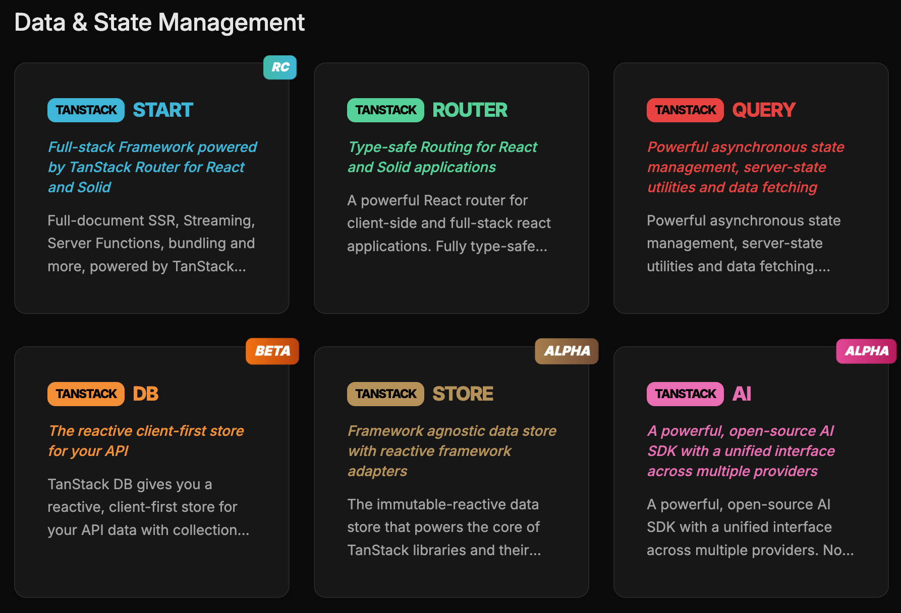
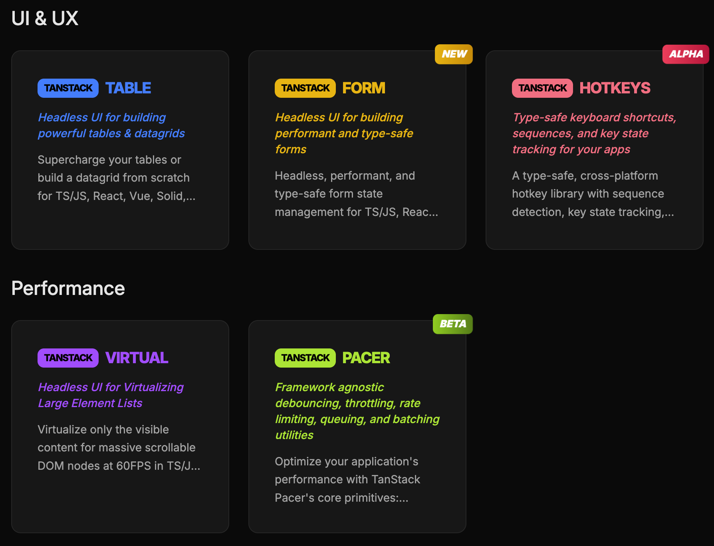
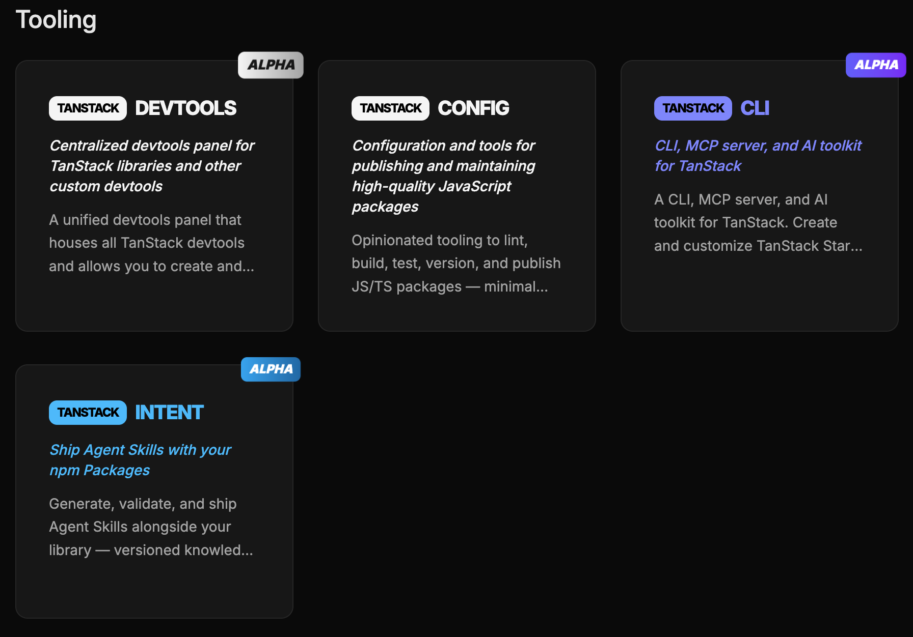
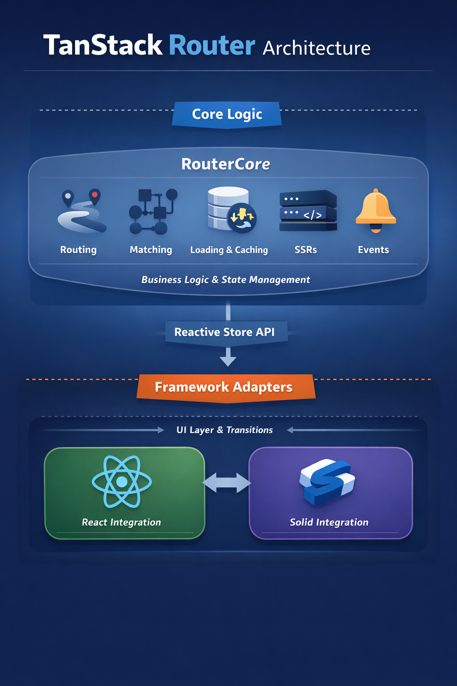

## 1. TanStack이란?

### 정의

여러 프레임워크를 위한 헤드리스 유틸리티 라이브러리 모음
Start, Query, Router, Table, Virtual, Store, AI 등의 라이브러리를 제공하고 있음





대표적으로 나와있는 건 이 정도로,

- 데이터 및 상태 관리
- UI UX
- 웹 성능 관련
- 도구

이렇게 크게 나뉘어 있다.

### 유래

탠스택은 초기에 React Query라는 이름으로, React 앱에서 서버 상태를 간편하게 관리하자는 목적으로 시작되었다.

React Query가 React 생태계에서 널리 사용되게 되면서, 다른 프레임워크에서도 같은 개념을 필요로 하는 사람들이 생기게 되었고 창시자인 Tanner Linsley는 React Query를 Tanstack Query로 리브랜딩하며 멀티 프레임워크 라이브러리로 확장했다.

이때 참고로 Tanstack은 창시자 Tanner의 Tan과 여러 프레임워크를 아우르는 Stack이라는 의미의 Stack을 합쳐 만든 이름이라고 한다.

이후 Tanstack이라는 브랜드 아래에 다양한 라이브러리를 추가로 개발해 확장하며 웹 개발에서 반복되는 문제를 하나의 철학과 패턴으로 통합해서 해결하는 풀스택 유틸리티 생태계로 진화하게 되었다.

## 2. 어떻게 사용하는지

### Tanstack 생태계의 공통 특징 (Tanstack Product Ethos)

공식 문서의 Tanstack Ethos에 따르면 Tanstack 생태계는 다음과 같은 철학을 가지고 있다.

먼저 오픈 웹, 오픈 표준, 그리고 사용자가 원하는 대로 작성, 배포할 수 있는 자유를 위해 구축하는 것이 그들의 철학이다.

- 독립적으로 소유하고, 편견 없는 설계

TanStack은 기술 방향에 대한 지배 이해관계나 숨겨진 의도 없이 독립적으로 운영된다고 한다.

오픈 웹, 오픈 표준, 그리고 원하는 것을 어디서나 작성하고 배포할 자유라는 핵심 가치를 공유하는 기업들과의 파트너십으로 자금을 조달받고 있다고 한다..

- 지속 가능한 미래

TanStack은 전임 창업자, 여러 저명하고 잘 후원하는 유지보수자, 계약자, 기여자, 그리고 우리의 핵심 가치를 공유하는 활발한 사용자 커뮤니티를 갖춘 간결하고 집중된 팀이다.

성장을 무조건 추구하기보다는, 개발자 경험, 커뮤니티 요구, 장기적 가치 창출을 우선시하는 지속 가능한 성장에 집중하며 개발자들의 작업 방식을 진정으로 개선하는 지속적인 도구를 만드는 목표를 가지고 있다고 한다.

결국 개발자 경험을 개선하는 도구를 만드는 것에 집중하고 있다는 뜻이다.

- 기술에 구애받지 않음

플랫폼에 구애받지 않는 도구를 만드는 것을 우선하고 있는 것으로 보인다.

따라서 다른 플랫폼에서 사용하더라도 동일하게 작동하도록 구현하며 지속적으로 연계된 기술이나 프레임워크에 대한 환경을 지원하거나 지원할 예정이라고 한다.

### Tanstack 라이브러리 설계의 핵심 원칙 (Tanstack Product Tenets)

1. 개방적이고 독립적이며 기술에 종속되지 않음

TanStack은 특정 벤더나 플랫폼에 종속되지 않는 구조를 가장 중요하게 본다. 모든 라이브러리는 중립적인 코어(core)를 기반으로 시작하며, 프레임워크나 서비스와의 통합은 선택적으로 붙는 어댑터 형태로 구성된다.

이 구조 덕분에 개발자는 특정 기술 스택에 묶이지 않고, 필요에 따라 자유롭게 교체하거나 확장할 수 있다. 또한 여러 서비스가 동일한 문제를 해결할 경우, 이를 일관된 추상화로 제공해 서로 교체 가능하도록 만든다. 대신, 모든 벤더의 세부 기능을 다 지원하려고 하지 않고, 실제로 많이 쓰이는 핵심 기능에 집중한다.

2. 조합 가능하고 플랫폼에 충실한 구조

TanStack은 “하나로 모든 걸 해결하는 프레임워크”보다는, 작고 조합 가능한 단위(primitive)를 제공하는 방식을 선택한다. 이는 기존 시스템을 유지하면서도 필요한 부분만 점진적으로 도입할 수 있게 하기 위함이다.

또한 웹, HTTP, JavaScript 같은 플랫폼 자체를 숨기지 않고 그대로 활용한다. 필요하다면 언제든지 추상화를 벗어나 직접 제어할 수 있는 escape hatch도 제공한다. 이로 인해 유연성과 확장성이 동시에 확보된다.

3. 실무 중심의 프로덕션 품질

TanStack은 단순한 데모가 아니라, 실제 서비스 환경에서의 사용을 기준으로 설계된다. 즉, 엣지 케이스, 장기 운영, 대규모 트래픽 상황까지 고려하는 것이 기본이다.

성능과 확장성은 선택 요소가 아니라 필수 조건이며, 기능은 “지금 당장 프로덕션에 써도 되는 수준”일 때만 완성으로 본다. 또한 개발자 경험(DX) 역시 단순히 편해 보이는 것이 아니라, 실제 생산성을 개선해야 한다는 기준을 가진다.

4. 예측 가능하고 명시적인 타입 안전성

TanStack은 “마법 같은 동작”을 지양하고, 코드만 봐도 동작을 이해할 수 있도록 설계한다. 상태 변화, 사이드 이펙트, 데이터 흐름은 모두 명확하게 드러나야 하며, 숨겨진 동작에 의존하지 않는다.

API는 암묵적이기보다 명시적이어야 하고, 예상치 못한 기본값은 버그로 간주한다. TypeScript 지원 역시 복잡도를 늘리는 것이 아니라, 올바른 사용을 유도하고 실제 버그를 줄이는 방향으로 활용된다. 또한 API 변경 시에는 안정성과 마이그레이션 경로를 매우 중요하게 다룬다.

## 3. 왜 써야하는지

### Tanstack 설계 원칙이 적용된 사례

위에서 TanStack은 특정 벤더나 플랫폼에 종속되지 않는 구조를 가장 중요하게 본다. 모든 라이브러리는 중립적인 코어(core)를 기반으로 시작하며, 프레임워크나 서비스와의 통합은 선택적으로 붙는 어댑터 형태로 구성된다는 설계 원칙이 있었다.

이에 따라 TanStack 라이브러리들은 공통적으로 프레임워크에 종속되지 않는 코어(Core)와, 이를 특정 UI 환경에 연결하는 프레임워크별 레이어(Adapter)로 분리된 구조를 가진다. 이 구조는 특정 기술 스택에 종속되지 않으면서도 재사용성과 확장성을 극대화하기 위한 설계다.

TanStack Router의 router-core는 이러한 철학이 실제 코드 레벨에서 어떻게 구현되는지를 잘 보여주는 대표적인 사례다.



packages/router-core는 React나 Solid 같은 UI 프레임워크와 완전히 분리된 라우터 엔진이다. 라우팅, 경로 매칭, 데이터 로딩, 캐싱, 이벤트 처리, SSR과 같은 모든 “라우터 비즈니스 로직”은 이 코어에서 담당한다.

React나 Solid 레이어는 단지 이 코어를 감싸는 역할만 수행하며, 실제로는 스토어 구현과 전환(transition) 처리만 주입한다. 즉, 동일한 RouterCore를 다양한 프레임워크에서 재사용할 수 있도록 설계되어 있으며, 그 경계는 stores.ts를 통한 스토어 주입 지점으로 명확히 나뉜다.

```
packages/
├── router-core/
│   └── src/
│       ├── route.ts
│       ├── new-process-route-tree.ts
│       └── stores.ts
├── react-router
├── solid-router
└── vue-router
```

TanStack Router의 core는 여러 파일로 역할이 나뉘어 있고, 각 파일이 하나의 책임을 맡아서 전체 라우팅 흐름을 구성한다. 전체 구조를 이해할 때는 “어떤 파일에서 어떤 일이 일어나는지” 기준으로 보는 게 가장 직관적이다.

먼저 route.ts에서는 라우트를 정의한다. 여기서의 라우트는 단순한 컴포넌트가 아니라, loader, beforeLoad, params, search validation 같은 정보를 포함하는 순수한 데이터 객체다. 이 라우트들은 서로 연결되어 트리 구조를 만들고, 초기화 과정에서 id나 fullPath 같은 값들이 계산된다.

이렇게 만들어진 라우트 트리는 new-process-route-tree.ts에서 처리된다. 이 파일에서는 라우트 트리를 세그먼트 트라이 구조로 변환해서, URL이 들어왔을 때 빠르게 어떤 라우트와 매칭되는지 찾을 수 있게 만든다. 이 단계에서 단순히 경로만 찾는 게 아니라, 어떤 라우트들이 연결된 체인인지와 params까지 포함된 결과가 만들어진다.

매칭 결과는 Matches.ts에서 정의된 RouteMatch라는 객체로 관리된다. 이 객체는 현재 라우팅 상태를 표현하는 핵심 모델로, pending/success/error 같은 상태와 loader 결과, context 등을 포함한다. 동시에 Promise나 AbortController 같은 값은 내부 필드로 따로 관리해서, UI 상태와 비동기 제어 로직을 분리하는 구조를 만든다.

이 상태들은 stores.ts에서 관리된다. 여기서는 Router가 사용하는 스토어들을 생성하는데, 특히 active, pending, cached라는 세 가지 상태 풀을 유지한다. 이를 통해 “지금 화면”, “로딩 중”, “캐시된 데이터”를 구분해서 관리할 수 있고, 필요한 경우 빠르게 재사용할 수 있다.

데이터 로딩은 load-matches.ts에서 담당한다. 이 파일에서는 beforeLoad → loader → 결과 처리 순서로 로직이 실행된다. beforeLoad는 순서를 보장하기 위해 직렬로 실행되고, loader는 병렬적으로 실행된다. 이 과정에서 에러, redirect, 지연 로딩 같은 상황도 함께 처리된다.

이 모든 흐름을 실제로 조정하는 중심은 router.ts에 있는 RouterCore다. RouterCore는 현재 URL(location)을 기준으로 라우트를 매칭하고, 그 결과를 pending 상태로 만든 뒤, load-matches를 호출해 데이터를 불러온다. 이후 로딩이 끝나면 pending 상태를 active로 바꾸고, 기존 데이터 중 재사용 가능한 것은 cached로 옮긴다. 그리고 오래된 캐시는 정리하는 GC 작업도 수행한다.

마지막으로 SSR은 ssr 관련 파일들에서 처리된다. 서버에서는 RouterCore를 실행해서 필요한 데이터를 미리 로딩하고, 그 상태를 직렬화해서 클라이언트로 전달한다. 클라이언트는 이 데이터를 받아서 hydration을 수행하며, 이 과정 역시 동일한 core 로직 위에서 동작한다.

결국 전체 흐름은 이렇게 정리할 수 있다.
라우트를 정의하고(route.ts) → 매칭 가능한 구조로 변환한 뒤(new-process-route-tree.ts) → 매칭 결과를 상태 객체로 만들고(Matches.ts) → 이를 스토어로 관리하며(stores.ts) → 로딩을 수행하고(load-matches.ts) → RouterCore(router.ts)가 전체 과정을 오케스트레이션한다. SSR도 이 흐름 위에서 동일하게 동작한다.

결과적으로 TanStack Router는 라우팅을 단순한 “UI 네비게이션 도구”가 아니라, 상태 머신 + 데이터 로딩 엔진 + 캐싱 시스템이 결합된 독립적인 런타임으로 설계한다. 그리고 React 같은 프레임워크는 이 엔진을 렌더링에 연결하는 얇은 레이어로만 존재한다.

이 구조는 TanStack이 추구하는 핵심 철학을 그대로 반영한다.
비즈니스 로직은 코어에, UI는 어댑터에 분리한다. 그리고 이를 통해 어떤 프레임워크에서도 동일한 동작과 경험을 제공한다.
