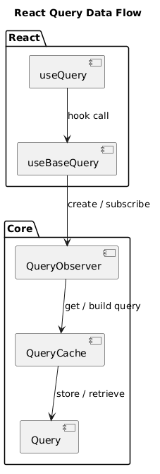

# QueryClient, 너 누군데?

## QueryClient의 정의

QueryClient는 서버 상태(Query, Mutation)를 전역에서 관리하는 중앙 관리자이다.

데이터를 저장하는 캐시의 역할뿐 아니라, 언제 데이터를 다시 가져와야 하는지 판단하고 실행까지 담당하는 컨트롤러에 가깝다.

```tsx
export class QueryClient {
  #queryCache: QueryCache;
  #mutationCache: MutationCache;
  #defaultOptions: DefaultOptions;
  #queryDefaults: Map<string, QueryDefaults>;
  #mutationDefaults: Map<string, MutationDefaults>;
  #mountCount: number;
  #unsubscribeFocus?: () => void;
  #unsubscribeOnline?: () => void;

  constructor(config: QueryClientConfig = {}) {
    this.#queryCache = config.queryCache || new QueryCache();
    this.#mutationCache = config.mutationCache || new MutationCache();
    this.#defaultOptions = config.defaultOptions || {};
    this.#queryDefaults = new Map();
    this.#mutationDefaults = new Map();
    this.#mountCount = 0;
  }
}
```

코드를 통해 알 수 있듯이, 쿼리 클라이언트는 아래 요소들을 내부에서 관리한다.

- QueryCache: query 데이터 캐시
- MutationCache: mutation 상태 관리
- defaultOptions: 전역 옵션
- 각 query / mutation의 기본 설정

## QueryClient의 mount

```tsx
mount(): void {
  this.#mountCount++
  if (this.#mountCount !== 1) return

  this.#unsubscribeFocus = focusManager.subscribe(async (focused) => {
    if (focused) {
      await this.resumePausedMutations()
      this.#queryCache.onFocus()
    }
  })
  this.#unsubscribeOnline = onlineManager.subscribe(async (online) => {
    if (online) {
      await this.resumePausedMutations()
      this.#queryCache.onOnline()
    }
  })
}
```

`QueryClient`는 여러 컴포넌트에서 동일한 인스턴스를 공유하기 때문에, 전역 이벤트 리스너가 중복 등록되지 않도록 `mountCount`를 사용해 최초 한 번만 등록한다.

이때 등록되는 이벤트는 두 가지이다.

- focusManager: 브라우저 탭이 포커스될 때 감지
- onlineManager: 네트워크 온라인/오프라인 상태 감지

그리고 이 두 가지 이벤트 리스너는 Query의 자동 재검증 기능의 핵심이다.

- 사용자가 탭을 다시 보았을 때(focusManager) stale 쿼리를 자동 재검증
- 사용자의 네트워크가 끊겼다가 다시 연결되면(onlineManager) 일시 중지되었던 요청을 다시 처리

## QueryClient의 mount - FocusManager

그럼 이 두 가지 이벤트 리스너는 어떤 식으로 작동하는 것일까? FocusManager의 작동부터 알아보자.

### 1. 구독 시작 (QueryClient.mount())

```tsx
// QueryClient mount 시에 호출
focusManager.subscribe(async (focused) => {
  if (focused) {
    await this.resumePausedMutations();
    this.#queryCache.onFocus();
  }
});
```

위에서 본 코드에서 QC가 마운트될 때 위와 같이 `focusManager.subscribe()` 로 리스너 콜백 함수를 넘긴다. 지금 넘기는 콜백함수가 포커스되었을 때 실행되는 함수인 것이다.

### 2. Subscribable.subscribe() 실행

```tsx
export class Subscribable<TListener extends Function> {
  protected listeners = new Set<TListener>();

  constructor() {
    this.subscribe = this.subscribe.bind(this);
  }

  subscribe(listener: TListener): () => void {
    this.listeners.add(listener);

    this.onSubscribe();

    return () => {
      this.listeners.delete(listener);
      this.onUnsubscribe();
    };
  }
}
```

focusManager 는 기본적으로 이 `Subscribable` 클래스를 상속받기 때문에 `subscribe` 라는 메서드를 가지는데, `subscribe` 메서드는 `listeners` Set에 매개변수로 받은 콜백 함수를 추가한 뒤 `this.onSubscribe()` 를 호출한다.

### 3. FocusManager.onSubscribe() 실행

```tsx
protected onSubscribe(): void {
  if (!this.#cleanup) {
    this.setEventListener(this.#setup)
  }
}
```

그렇게 되면 `this` 인 `FocusManager` 의 `onSubscribe` 가 실행된다. 이후 `this.setEventListener(this.#setup)`이 호출된다.

### 4. setEventListener(this.#setup) 실행

```tsx
setEventListener(setup: SetupFn): void {
  this.#setup = setup
  this.#cleanup?.()
  this.#cleanup = setup((focused) => {
    if (typeof focused === 'boolean') {
      this.setFocused(focused)
    } else {
      this.onFocus()
    }
  })
}
```

`setEventListener`는 이벤트 리스너의 생애주기를 관리하는 함수이다.

1. 새로운 setup 함수를 매개변수로 받아 내부에 저장
2. 기존에 등록되어 있던 리스너가 있으면 cleanup으로 제거
3. 이후 새로운 이벤트 리스너를 등록
4. 이벤트 리스너 함수 실행 이후 cleanup 함수를 저장

이 네 가지 절차를 진행한다.

```tsx
setup((focused) => {
  // 이 콜백이 onFocus 매개변수로 전달되게 된다.
  if (typeof focused === "boolean") {
    this.setFocused(focused);
  } else {
    this.onFocus();
  }
});
```

이때 지금 콜백으로 넘겨주고 있는 함수가 `onFocus` 매개변수인데,

`onFocus` 매개변수는 두 가지 역할을 한다.

1. 매개변수 없이 호출되었을 때 `onFocus()`
   - 브라우저 이벤트에서 호출
   - 현재 상태를 다시 확인하고 알림
2. boolean과 함께 호출되었을 때 `onFocus(true)` 또는 `onFocus(false)`
   - 명시적으로 포커스 상태 설정
   - 테스트나 수동 제어에서 사용

이때 `focused` 는 `setEventListener` 로 등록한 `setup` 이 해당 콜백을 어떻게 호출하느냐에 따라 결정된다.

### 5. #setup 함수 내부 실행

이제 constructor에서 정의한 함수가 실행된다.

```tsx
this.#setup = (onFocus) => {
  // addEventListener does not exist in React Native, but window does
  // eslint-disable-next-line @typescript-eslint/no-unnecessary-condition
  if (typeof window !== "undefined" && window.addEventListener) {
    const listener = () => onFocus();
    // Listen to visibilitychange
    window.addEventListener("visibilitychange", listener, false);

    return () => {
      // Be sure to unsubscribe if a new handler is set
      window.removeEventListener("visibilitychange", listener);
    };
  }
  return;
};
```

여기서 중요한 것은 아래 부분이다.

```tsx
const listener = () => onFocus(); // 이 onFocus는 위에서 전달받은 콜백이다
window.addEventListener("visibilitychange", listener, false);
```

이제 `listener`는 클로저를 통해 `onFocus` 콜백을 가지게 되고, visibilitychange 이벤트가 발생하면 리스너 함수가 실행된다.

### 6. 탭 포커스 시 실행 체인

그래서 사용자가 탭을 전환하면 아래 순서로 실행된다.

1. 브라우저에서 visibilitychange 이벤트 발생
2. `listener()` 실행
3. `onFocus()` 실행 (setEventListener에서 전달한 콜백)

```tsx
(focused) => {
  if (typeof focused === "boolean") {
    this.setFocused(focused);
  } else {
    this.onFocus(); // 매개변수 없으므로 이쪽 실행
  }
};
```

1. `this.onFocus()` 실행

```tsx
onFocus(): void {
  const isFocused = this.isFocused()
  this.listeners.forEach((listener) => {
    listener(isFocused)
  })
}
```

1. 모든 구독자(listeners)에게 알림
2. QueryClient의 콜백 실행

```tsx
async (focused) => {
  if (focused) {
    await this.resumePausedMutations();
    this.#queryCache.onFocus();
  }
};
```

이 흐름을 통해 중단된 mutation이 재개되고, query cache에 이벤트가 전파되며 stale query가 자동으로 refetch되는 것이다.

## QueryClient의 mount - OnlineManager

OnlineManager도 동작 방식은 FocusManager와 거의 유사하다. OnlineManager는 사용자의 인터넷 상태 파악해서 온라인일 경우 콜백 함수를 실행시킨다.

### 1. 구독 시작 (QueryClient.mount())

```tsx
// QueryClient mount 시에 호출
onlineManager.subscribe(async (online) => {
  if (online) {
    await this.resumePausedMutations();
    this.#queryCache.onOnline();
  }
});
```

위에서 본 코드에서 QC가 마운트될 때 위와 같이 `onlineManager.subscribe()` 로 리스너 콜백 함수를 넘긴다. 지금 넘기는 콜백함수가 FocusManager 때와 마찬가지로 온라인 상태가 되었을 때 실행된다.

### 2. Subscribable.subscribe() 실행

```tsx
export class Subscribable<TListener extends Function> {
  protected listeners = new Set<TListener>();

  constructor() {
    this.subscribe = this.subscribe.bind(this);
  }

  subscribe(listener: TListener): () => void {
    this.listeners.add(listener);

    this.onSubscribe();

    return () => {
      this.listeners.delete(listener);
      this.onUnsubscribe();
    };
  }
}
```

이 부분도 FocusManager와 동일하다. OnlineManager 또한 Subscribable을 상속받기 때문에 `Subscribable.subscribe()` 메서드가 실행된다.

### 3. OnlineManager.onSubscribe() 실행

```tsx
protected onSubscribe(): void {
  if (!this.#cleanup) {
    this.setEventListener(this.#setup)
  }
}
```

이 부분 또한 FocusManager와 유사하다.

### 4. setEventListener(this.#setup) 실행

이 부분은 focusManager보다 간단하게 설계되어 있다.

```tsx
setEventListener(setup: SetupFn): void {
  this.#setup = setup
  this.#cleanup?.()
  this.#cleanup = setup(this.setOnline.bind(this))
}
```

focusManager의 경우 focused의 타입을 기반으로 이벤트의 발생 여부를 직접 계산하는 로직이 있었다. focusManager의 기본 이벤트는 visibilitychange인데, 이 이벤트는 boolean을 직접 주지 않고 변경되었는지 여부만 알려주기 때문이다. 그래서 onFocus()로 들어오면 내부에서 isFocused()를 다시 계산했다.

- 그래서 focusManager의 setup 인자는 `(focused?: boolean) => void`이고,
  - boolean이 오면 `setFocused(focused)` (명시 상태 설정),
  - 값이 없으면 `onFocus()` (현재 상태 재평가 + 알림) 으로 나뉘게 되는 것이었다

핵*심은* `online`은 값(event payload) 중심, `focus`는 신호(signal)와 값이 혼합되어 있기 때문이다.

`onlineManager` 의 경우에는 브라우저 `online/offline` 이벤트가 이미 `true/false`를 명확하게 제공한다. 따라서  `setup(this.setOnline.bind(this))`처럼 바로 상태 setter를 넘긴다.

결론적으로 이벤트가 상태값을 직접 주는지 아닌지에 따라 달라진 구조라고 할 수 있다.

### 5. #setup 함수 내부 실행

```tsx
this.#setup = (onOnline) => {
  // addEventListener does not exist in React Native, but window does
  // eslint-disable-next-line @typescript-eslint/no-unnecessary-condition
  if (typeof window !== "undefined" && window.addEventListener) {
    const onlineListener = () => onOnline(true);
    const offlineListener = () => onOnline(false);
    // Listen to online
    window.addEventListener("online", onlineListener, false);
    window.addEventListener("offline", offlineListener, false);

    return () => {
      // Be sure to unsubscribe if a new handler is set
      window.removeEventListener("online", onlineListener);
      window.removeEventListener("offline", offlineListener);
    };
  }

  return;
};
```

onlineManager도 이렇게 클로저를 통해 리스너 함수를 받아와 실제 이벤트 리스너로 등록하게 된다.

### 복잡한 설계의 이유

focusManager, onlineManager의 이벤트 리스너 등록 과정은 정말 복잡하다. 왜 이렇게 여러 계층을 통해 추상화하며 이벤트를 등록했을까?

주된 이유는

- 플랫폼 차이 대응
- 안정성

이라고 생각한다.

이런 구현을 통해 플랫폼 차이에 대응할 수 있는 이유는 이렇다. 탠스택 쿼리는 웹 환경 뿐 아니라 React Native에서도 사용 가능하도록 설계되었다. 이 구현 내용은 query-core 이기 때문에 아마 React Native 특화 기능의 경우 별도의 계층이 있을 테지만, 그 이전에 모든 계층에서 호환되도록 core를 설계한 것으로 보인다.

```tsx
constructor() {
  super()
  this.#setup = (onFocus) => {
    // addEventListener does not exist in React Native, but window does
    // eslint-disable-next-line @typescript-eslint/no-unnecessary-condition
    if (typeof window !== 'undefined' && window.addEventListener) {
      const listener = () => onFocus()
      // Listen to visibilitychange
      window.addEventListener('visibilitychange', listener, false)

      return () => {
        // Be sure to unsubscribe if a new handler is set
        window.removeEventListener('visibilitychange', listener)
      }
    }
    return
  }
}
```

기본적으로 셋업 함수는 이렇게 웹 이벤트 리스너 기반으로 설계되어 있지만, `setEventListener` 에서 인자로 받은 `setup` 함수로 교체가 가능하다.

따라서 `window` 가 없는 React Native 환경에서는

```tsx
onlineManager.setEventListener((setOnline) => {
  return NetInfo.addEventListener((state) => {
    setOnline(!!state.isConnected);
  });
});
```

React Native 전용 이벤트 소스인 Appstate, NetInfo 를 사용해서 이벤트 핸들러를 교체할 수 있다.

그리고 클로저를 통해 cleanup 함수를 같은 스코프에 묶어 보관하기에 등록 및 해제 시에 짝이 안 맞는 실수를 줄일 수 있다고 한다. `setEventListener -> 기존 cleanup 호출 -> 새 setup 등록 -> 새 cleanup 저장` 이 순서를 강제해서 일관성을 확보한다. 중복 등록 방지 + 누수 방지 + 수명주기 일관성을 확보하게 되는 것이다.

## 그래서 어떤 것을 하나요?

QueryClient의 마운트 시점에 발생하는 일들을 알아보았다.
두 가지 이벤트 리스너를 통해 사용자가 탭에 다시 돌아왔을 때, 혹은 네트워크가 복구되었을 때 중단되었던 Mutation을 재개하고, onFocus 및 onOnline 시점에 필요한 작업을 수행할 수 있었다

그렇다면 이 구조는 실제로 어떤 일을 할까? 핵심은 서버 상태를 적절한 타이밍에 다시 동기화한다는 점이다.

일반적으로 서버 데이터는 시간이 지나면 stale한 상태가 된다. 하지만 사용자가 다시 화면을 보거나 네트워크가 복구되는 순간은 데이터를 최신 상태로 갱신하기에 아주 자연스러운 타이밍이다.

그래서 QueryClient는 이런 시점을 자동으로 감지해

- 탭에 다시 돌아왔을 때 stale한 query를 재검증하고
- 네트워크가 복구되었을 때 중단된 요청을 재시도

하는 것이다.

개발자가 언제 다시 요청을 보내야 할지 고민하지 않아도 적절한 타이밍에 자동으로 서버 상태를 최신으로 유지해주는 역할을 한다.

하지만 굳이 최신으로 유지하지 않아도 되는 데이터, stale time이 긴 데이터 등이 있을 수 있다.

탠스택 쿼리는 이런 상황도 다룰 수 있도록 설계되었다.

- refetchOnWindowFocus를 통해 포커스 시 재요청 여부를 제어하거나,
- retry 옵션으로 재시도 횟수를 설정하고
- mutationCache를 통해 전역 에러 처리를 구성할 수도 있다.

어떤 옵션들이 있을지 더 자세하게 살펴보자.

## QueryClient 생성과 옵션 설정

앞서 QueryClient가 서버 상태의 동기화를 관리하는 컨트롤러 역할을 한다는 것을 살펴보았다.

그렇다면 이 QueryClient는 어떻게 생성하고, 어떤 방식으로 동작을 제어할 수 있을까?

QueryClient는 생성 시점에 다양한 옵션을 통해 전역 동작 정책을 설정할 수 있다.

```tsx
export interface QueryClientConfig {
  queryCache?: QueryCache;
  mutationCache?: MutationCache;
  defaultOptions?: DefaultOptions;
}
```

쿼리클라이언트를 생성할 때에는 다음과 같은 Config 객체를 인자로 받는다. 객체에는 세 가지 속성이 있는데,

- queryCache
- mutationCache
- defaultOptions

이다.

### queryCache란?

useQuery로 실행된 모든 쿼리 인스턴스를 저장하고 관리하는 저장소이다.

```tsx
this.#queryCache = config.queryCache || new QueryCache();
```

생략하면 기본 QueryCache() 가 자동으로 생성된다. 만약 직접 넘기게 된다면 QueryCache 생성 시 전역 onError, onSuccess, onSettled 콜백을 달 수 있다.

```tsx
const queryClient = new QueryClient({
  queryCache: new QueryCache({
    onError: (error) => console.log("쿼리 에러:", error),
  }),
});
```

## mutationCache란?

useMutation으로 실행된 모든 뮤테이션 인스턴스를 저장하고 관리하는 저장소이다.

```tsx
this.#mutationCache = config.mutationCache || new MutationCache();
```

mutationCache 또한 생략하면 기본 생성되며 전역 onError, onSuccess, onMutate, onSettled 같은 전역 콜백을 달아줄 수 있다.

```tsx
const queryClient = new QueryClient({
  mutationCache: new MutationCache({
    onError: (error, _variables, _context, mutation) => {
      Sentry.captureException(error);

      const errorMessages = mutation.meta?.errorMessages;
      const customMessage =
        error instanceof BusinessError
          ? errorMessages?.[error.code]
          : undefined;

      toastError(
        customMessage ??
          (error instanceof BusinessError
            ? error.message
            : "일시적인 오류가 발생했습니다. 잠시 후 다시 시도해주세요.")
      );
    },
  }),
});
```

따라서 우리 프로젝트 같은 경우에는 위처럼 전역 에러 처리를 수행했었다.

## defaultOptions는?

모든 쿼리와 뮤테이션에 공통으로 적용할 기본 옵션이다.

```tsx
export interface DefaultOptions<TError = DefaultError> {
  queries?: OmitKeyof<
    QueryObserverOptions<unknown, TError>,
    "suspense" | "queryKey"
  >;
  mutations?: MutationObserverOptions<unknown, TError, unknown, unknown>;
  hydrate?: HydrateOptions["defaultOptions"];
  dehydrate?: DehydrateOptions;
}
```

- `queries` — 모든 `useQuery`에 적용되는 기본값
- `QueryObserverOptions`에서 `suspense`와 `queryKey`만 제외하고 나머지 전부 설정 가능하다. 이 두 가지는 개별 쿼리마다 달라야 해서 제외된다.
  **`QueryOptions`에서 상속받는 것들**
  | 옵션 | 역할 |
  | ------------------- | ------------------------------ |
  | `retry` | 실패 시 재시도 횟수/조건 |
  | `retryDelay` | 재시도 간격 |
  | `gcTime` | 미사용 캐시 메모리 보존 시간 |
  | `networkMode` | 오프라인 동작 방식 |
  | `structuralSharing` | 이전 데이터와 구조 비교 최적화 |
  | `meta` | 쿼리에 추가 메타데이터 |
  | `queryFn` | 기본 쿼리 함수 |
  **`QueryObserverOptions`가 추가하는 것들**
  | 옵션 | 역할 |
  | ----------------------------- | ---------------------------------- |
  | `enabled` | 자동 실행 여부 |
  | `staleTime` | 데이터를 stale로 간주하는 시간 |
  | `refetchInterval` | 폴링 간격 |
  | `refetchIntervalInBackground` | 백그라운드에서도 폴링 여부 |
  | `refetchOnWindowFocus` | 포커스 시 재요청 여부 |
  | `refetchOnReconnect` | 재연결 시 재요청 여부 |
  | `refetchOnMount` | 마운트 시 재요청 여부 |
  | `retryOnMount` | 에러 상태로 마운트 시 재시도 여부 |
  | `notifyOnChangeProps` | 리렌더 트리거 프로퍼티 제한 |
  | `throwOnError` | 에러를 ErrorBoundary로 던질지 여부 |
  | `placeholderData` | 로딩 중 대체 데이터 |
  | `select` | 데이터 변환/선택 함수 |
- `mutations` — 모든 `useMutation`에 적용되는 기본값
  `MutationOptions` + `throwOnError`를 설정할 수 있다
  | 옵션 | 역할 |
  | -------------------------------------------------- | ----------------------- |
  | `retry` / `retryDelay` | 실패 시 재시도 |
  | `networkMode` | 오프라인 동작 방식 |
  | `gcTime` | mutation 캐시 보존 시간 |
  | `onMutate` / `onSuccess` / `onError` / `onSettled` | 전역 mutation 콜백 |
  | `throwOnError` | 에러 버블링 여부 |
  | `meta` | 추가 메타데이터 |
  | `scope` | mutation 직렬화 범위 |
- `hydrate` / `dehydrate` — SSR 직렬화/복원 기본값
- 서버에서 클라이언트로 데이터를 넘길 때(`dehydrate`/`hydrate`) 기본 옵션을 설정한다고 한다. SSR 환경이 아니면 거의 사용하지 않는 것이 특징이다.

```tsx
const queryClient = new QueryClient({
  defaultOptions: {
    queries: {
      refetchOnWindowFocus: false,
      throwOnError: (error) => !(error instanceof BusinessError),
      retry: (failureCount, error) =>
        error instanceof BusinessError ? false : failureCount < 2,
    },
    mutations: {
      retry: 0,
      onError: (error) => console.error(error),
    },
  },
});
```

## QueryClient는 그래서..

지금까지 살펴본 내용을 종합해보면, QueryClient는 단순히 데이터를 캐싱하는 객체가 아니라 서버 상태의 생명주기를 관리하는 전역 컨트롤러라고 볼 수 있다. 쿼리와 뮤테이션의 실행 결과를 저장하고, 브라우저의 포커스나 네트워크 상태 변화 같은 외부 이벤트를 감지하여 적절한 시점에 데이터를 다시 동기화한다. 또한 defaultOptions, queryCache, mutationCache를 통해 재시도 정책, 에러 처리, refetch 전략 등을 중앙에서 일관되게 정의할 수 있다. 즉, “언제 요청할지, 실패하면 어떻게 할지, 사용자에게 어떻게 보여줄지” 같은 서버 상태의 정책을 한 곳에서 통제하는 역할을 수행한다.

이렇게 생성된 QueryClient는 React 애플리케이션에서 QueryClientProvider를 통해 전역으로 주입되어 사용된다. (QueryClientProvider는 Context API 기반으로 만들어졌다!)

```tsx
"use client";
import * as React from "react";

import type { QueryClient } from "@tanstack/query-core";

export const QueryClientContext = React.createContext<QueryClient | undefined>(
  undefined
);

export const useQueryClient = (queryClient?: QueryClient) => {
  const client = React.useContext(QueryClientContext);

  if (queryClient) {
    return queryClient;
  }

  if (!client) {
    throw new Error("No QueryClient set, use QueryClientProvider to set one");
  }

  return client;
};

export type QueryClientProviderProps = {
  client: QueryClient;
  children?: React.ReactNode;
};

export const QueryClientProvider = ({
  client,
  children,
}: QueryClientProviderProps): React.JSX.Element => {
  React.useEffect(() => {
    client.mount();
    return () => {
      client.unmount();
    };
  }, [client]);

  return (
    <QueryClientContext.Provider value={client}>
      {children}
    </QueryClientContext.Provider>
  );
};
```

Provider를 기준으로 하위 컴포넌트들은 동일한 QueryClient 인스턴스를 공유하며, useQuery, useMutation 같은 훅들이 이 컨텍스트를 통해 캐시와 설정에 접근하게 된다. 결과적으로 개발자는 각 컴포넌트에서 데이터 요청 로직을 반복해서 작성할 필요 없이, QueryClient에 정의된 정책을 기반으로 일관된 방식으로 서버 상태를 다룰 수 있게 된다.

## 정리

- QueryClient는 Query/Mutation 캐시를 들고 있는 “저장소”이면서, refetch·retry·에러 처리 같은 정책을 중앙에서 통제하는 “컨트롤러”다.
- mount 시 focus/online 이벤트를 한 번만 구독해, 탭 복귀나 네트워크 복구 같은 자연스러운 타이밍에 stale query 재검증과 일시중지 mutation 재개를 수행한다.
- queryCache/mutationCache에 전역 콜백을 달 수 있고, defaultOptions로 모든 query/mutation의 기본 동작(예: refetchOnWindowFocus, retry)을 일관되게 설정한다.
- 이렇게 구성된 QueryClient는 QueryClientProvider(Context)로 앱 전역에 주입되어, 각 컴포넌트의 useQuery/useMutation이 같은 정책/캐시를 공유하게 된다.

# useQuery는 어떻게 동작할까?

useQuery는 어떻게 동작할까? useQuery 또한 다양한 계층으로 추상화되어 있다.



react 단에서 useQuery, useBaseQuery의 콜 이후 실제 동작은 core에서 수행된다. 자세하게 살펴보자.

## useQuery의 동작 방식

### 1. React 단에서 useQuery 호출

```tsx
export function useQuery(options: UseQueryOptions, queryClient?: QueryClient) {
  return useBaseQuery(options, QueryObserver, queryClient);
}
```

useQuery는 QueryObserver를 useBaseQuery에 넘기는 것 외에는 아무 일도 하지 않는다.

실제 핵심 로직은 useBaseQuery부터 시작된다.

### 2. React의 useBaseQuery에서 동작

```tsx
const client = useQueryClient(queryClient);
const defaultedOptions = client.defaultQueryOptions(options);
```

useBaseQuery에서는 context에서 queryClient를 가져오고, defaultOptions와 병합해 최종 옵션을 만들게 된다.

### 3. QueryObserver 생성

이후 observer를 생성한다.

```tsx
const [observer] = React.useState(
  () =>
    new Observer<TQueryFnData, TError, TData, TQueryData, TQueryKey>(
      client,
      defaultedOptions
    )
);
```

useState를 사용해 옵저버를 만들기 때문에 리렌더링 시에도 같은 인스턴스가 유지된다. (옵저버에 대해서는 아래에서 후술!! 옵저버가 쿼리 구현의 핵심이다) 옵저버는 컴포넌트와 쿼리를 연결하는 지속적인 연결점이다.

### 4. useSyncExternalStore로 상태 구독

```tsx
React.useSyncExternalStore(
  React.useCallback(
    (onStoreChange) => {
      const unsubscribe = shouldSubscribe
        ? observer.subscribe(notifyManager.batchCalls(onStoreChange))
        : noop;
      observer.updateResult();
      return unsubscribe;
    },
    [observer, shouldSubscribe]
  ),
  () => observer.getCurrentResult(),
  () => observer.getCurrentResult()
);
```

여기서 React와 Query가 연결된다. 동작을 보면

1. observer.subscribe()로 상태 변화 구독
2. Query 상태가 바뀌면 onStoreChange 실행
3. React 리렌더링 발생

즉 Query → Observer → React로 상태가 전파된다.

### 5. 옵션 변경 시 Observer 업데이트

```tsx
React.useEffect(() => {
  observer.setOptions(defaultedOptions);
}, [defaultedOptions, observer]);
```

옵션이 변경되면

- observer에 새로운 옵션을 반영하고
- 필요하면 refetch 등의 동작이 발생한다.

## 옵저버 이것 뭐에요~??

옵저버는 Query와 React 컴포넌트 사이의 중간 관리자이다. 하나의 쿼리는 여러 컴포넌트에서 동시에 쓸 수 있는데, 각 컴포넌트가 각자의 옵션을 가지기 때문에 컴포넌트마다 QueryObserver가 하나씩 붙고, Observer가 그 컴포넌트에 맞게 결과를 필터 및 변환해서 알려주는 것이다.

```
같은 queryKey 사용

Query (1개)
 ├─ Observer A (select: name)
 ├─ Observer B (select: age)
 └─ Observer C (full data)
```

컴포넌트 10개가 같은 `queryKey`를 쓰면, `Query` 인스턴스는 하나지만 `QueryObserver`는 10개가 각자 붙어서 각자의 옵션으로 결과를 받는 것이다.

```tsx
#client: QueryClient
#currentQuery: Query<...>
#currentResult: QueryObserverResult<TData, TError>
#staleTimeoutId?: ManagedTimerId
#refetchIntervalId?: ManagedTimerId
#trackedProps = new Set<keyof QueryObserverResult>()
```

옵저버의 주요 역할은 다음과 같다.

- Query 인스턴스 연결
- 상태 변화 감지
- 데이터 가공 (select, placeholderData)
- 타이머 관리 (staleTime, refetchInterval)
- React에 결과 전달

### 6. Query와 Observer 연결

```tsx
#updateQuery(): void {
  const query = this.#client.getQueryCache().build(this.#client, this.options)
  ...
  this.#currentQuery = query
  ...
  prevQuery?.removeObserver(this)
  query.addObserver(this)
}
```

이 과정에서

1. QueryCache에서 Query를 찾거나 생성하고,
2. 현재 Observer를 Query에 등록한다.

이로 인해 하나의 Query & 여러 개의 Observer 구조가 만들어진다.

### **7. 첫 구독 시 fetch 실행**

```tsx
protected onSubscribe(): void {
  if (this.listeners.size === 1) {
    this.#currentQuery.addObserver(this)

    if (shouldFetchOnMount(this.#currentQuery, this.options)) {
      this.#executeFetch()
    } else {
      this.updateResult()
    }

    this.#updateTimers()
  }
}
```

이후 첫 구독이 발생하면

1. Query에 Observer 등록
2. fetch 필요 여부 판단
3. 필요하면 fetch 실행
4. 타이머 설정

이 일어난다.

## 정리

- useQuery는 useBaseQuery에 QueryObserver를 넘겨주는 얇은 래퍼이고, 실제 로직은 useBaseQuery에서 시작된다.
- useBaseQuery는 useQueryClient()로 QueryClient를 가져온 뒤, client.defaultQueryOptions(options)로 전역 defaultOptions와 합쳐 최종 옵션을 만든다.
- 컴포넌트는 QueryObserver를 1회 생성해 유지한다(useState로 생성). 같은 queryKey를 쓰는 컴포넌트가 여러 개면 Query 인스턴스는 1개지만 Observer는 컴포넌트 수만큼 붙는다.
- useSyncExternalStore로 Observer의 외부 상태를 구독한다. Query 상태 변화 → Observer 알림 → React 리렌더가 이어지는 연결 고리다.
- 옵션이 바뀌면 observer.setOptions(defaultedOptions)가 실행되어 필요 시 refetch 등 후속 동작이 트리거된다.
- Observer는 QueryCache.build()로 Query를 찾거나 만들고(queryKey 기준), 기존 Query에서 분리한 뒤 새 Query에 addObserver로 등록한다.
- 첫 구독 시(listeners.size === 1) shouldFetchOnMount를 검사해 필요하면 #executeFetch()로 초기 fetch를 수행하고, staleTime/refetchInterval 기반 타이머를 설정한다.
- 결과적으로 useQuery는 Query(공유된 캐시/상태)와 Observer(컴포넌트별 옵션/구독/타이머)를 분리해, 데이터는 공유하고 표현은 컴포넌트별로 동작하도록 만든 구조다.
