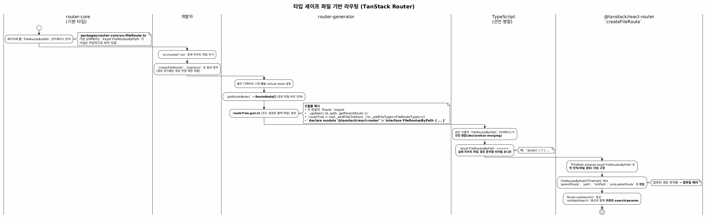

# Router

# 타입 세이프 라우팅은 어떻게 이루어질까?

## 타입 시스템의 출발점, 비어 있는 인터페이스

TanStack Router의 타입 세이프 파일 기반 라우팅은 단순한 파일 구조 매핑이 아니라,
타입이 생성되고 확장되는 흐름을 중심으로 동작하는 구조이다.

<aside>
💡

전체 과정은
“비어 있는 타입 정의 → 생성기를 통한 타입 주입 → TypeScript 선언 병합 → API에서 타입 강제”
의 단계로 이해할 수 있다.

</aside>

먼저  router-core  내부에는  `FileRoutesByPath` 라는 인터페이스가 정의되어 있다. 이 인터페이스는 초기 상태에서는 아무런 프로퍼티도 가지지 않는 빈 타입이다.

따라서 이 시점에서  `keyof FileRoutesByPath` 는 유효한 경로를 전혀 포함하지 않는 상태이다. 즉, 타입 시스템의 기본 골격만 존재하는 단계이다.

```tsx
// router-core/src/fileRoute.ts

export interface FileRoutesByPath {
  // '/': {
  //   parentRoute: typeof rootRoute
  // }
}
```

## 파일 기반 라우트 정의

개발자가 tanstack router를 사용할 때에는 src/routes 디렉터리 아래에 라우트 파일을 생성하고, 각 파일에서  `createFileRoute` 를 사용해 라우트를 정의하게 된다.

```
src/
└── routes/
    ├── __root.tsx
    ├── index.tsx
    ├── posts.tsx
    └── posts.$postId.tsx
```

```tsx
// index.tsx

import { createFileRoute } from "@tanstack/react-router";

export const Route = createFileRoute("/")({
  component: () => <div>Home</div>,
});
```

```tsx
// posts.tsx

import { createFileRoute } from "@tanstack/react-router";

export const Route = createFileRoute("/posts")({
  component: () => <div>Posts List</div>,
});
```

```tsx
// posts.$postId.tsx

import { createFileRoute } from "@tanstack/react-router";

export const Route = createFileRoute("/posts/$postId")({
  component: () => {
    return <div>Post Detail</div>;
  },
});
```

이 단계에서는 아직 생성기가 동작하기 전이므로, 경로 문자열에 대한 타입 제약이 완전히 강제되지는 않는다. 따라서 이 시점은 타입 안정성이 완성되기 전의 준비 단계라고 볼 수 있다.

## 파일 시스템 스캔을 통한 라우트 수집

이후  `router-generator` 가 프로젝트의 라우트 파일들을 스캔한다.
이 과정에서 각 파일의 경로, 라우트 계층 구조, 부모-자식 관계 등을 분석하여  `RouteNode`  구조로 정리한다.

```tsx
// router-generator/src/types.ts

export type RouteNode = {
  filePath: string;
  fullPath: string;
  variableName: string;
  _fsRouteType: FsRouteType;
  routePath?: string;
  originalRoutePath?: string;
  cleanedPath?: string;
  path?: string;
  isNonPath?: boolean;
  isVirtualParentRoute?: boolean;
  isVirtual?: boolean;
  children?: Array<RouteNode>;
  parent?: RouteNode;
  createFileRouteProps?: Set<string>;
  /**
   * For virtual routes: the routePath of the explicit parent from virtual config.
   * Used to prevent auto-nesting siblings based on path prefix matching (#5822, #5431).
   * Falls back to path-based inference if the explicit parent is not found
   * (e.g., when the parent is a virtual file-less route that gets filtered out).
   */
  _virtualParentRoutePath?: string;
};
```

라우트 파일 스캔 과정에서 가상 라우트 설정이 있으면 virtualGetRouteNodes 분기로 가서 로직이 실행되는데, 물리 파일 트리의 경우만 살펴보았다.

```tsx
  private async generatorInternal() {
    let writeRouteTreeFile: boolean | 'force' = false

    let getRouteNodesResult: GetRouteNodesResult

    if (this.config.virtualRouteConfig) {
      getRouteNodesResult = await virtualGetRouteNodes(this.config, this.root, {
        indexTokenSegmentRegex: this.indexTokenSegmentRegex,
        routeTokenSegmentRegex: this.routeTokenSegmentRegex,
      })
    } else {
      getRouteNodesResult = await physicalGetRouteNodes(
        this.config,
        this.root,
        {
          indexTokenSegmentRegex: this.indexTokenSegmentRegex,
          routeTokenSegmentRegex: this.routeTokenSegmentRegex,
        },
      )
    }
```

물리 파일 트리는 `filesystem/physical/getRouteNodes.ts`의 `getRouteNodes`가 `readdir`로 재귀 순회하면서 노드를 쌓는다.

```tsx
// router-generator/src/filesystem/physical/getRouteNodes.ts

export async function getRouteNodes(
  config: Pick<
    Config,
    | 'routesDirectory'
    | 'routeFilePrefix'
    | 'routeFileIgnorePrefix'
    | 'routeFileIgnorePattern'
    | 'disableLogging'
    | 'routeToken'
    | 'indexToken'
  >,
  root: string,
  tokenRegexes: TokenRegexBundle,
): Promise<GetRouteNodesResult> {
  const { routeFilePrefix, routeFileIgnorePrefix, routeFileIgnorePattern } =
    config

  const logger = logging({ disabled: config.disableLogging })
  const routeFileIgnoreRegExp = new RegExp(routeFileIgnorePattern ?? '', 'g')

  const routeNodes: Array<RouteNode> = []
  const allPhysicalDirectories: Array<string> = []

  async function recurse(dir: string) {
    const fullDir = path.resolve(config.routesDirectory, dir)
    let dirList = await fsp.readdir(fullDir, { withFileTypes: true })
```

## 부모와 자식 관계 해석을 통한 트리 구성

스캔된 노드마다 RoutePrefixMap / routeNodesByPath를 기반으로 부모를 결정하고, node.parent를 설정한다. 이 과정에서 라우트 계층 구조가 완성된다.

핵심은 Generator.handleNode이며, 이 단계에서 실제 라우트 트리의 구조가 결정된다.

```tsx
  // router-generator/src/generator.ts

  private static handleNode(
    node: RouteNode,
    acc: HandleNodeAccumulator,
    prefixMap: RoutePrefixMap,
    config?: Config,
  ) {
    let parentRoute = hasParentRoute(prefixMap, node, node.routePath)

    // Check routeNodesByPath for a closer parent that may not be in prefixMap.
    // ...
    if (node.routePath) {
      let searchPath = node.routePath
      while (searchPath.length > 0) {
        const lastSlash = searchPath.lastIndexOf('/')
        if (lastSlash <= 0) break

        searchPath = searchPath.substring(0, lastSlash)
        const candidate = acc.routeNodesByPath.get(searchPath)
        // ... closer parent 선택 ...
      }
    }

    // Virtual routes may have an explicit parent from virtual config.
    if (node._virtualParentRoutePath !== undefined) {
      const explicitParent = acc.routeNodesByPath.get(
        node._virtualParentRoutePath,
      )
      if (explicitParent) {
        parentRoute = explicitParent
      } else if (node._virtualParentRoutePath === `/${rootPathId}`) {
        parentRoute = null
      }
    }

    if (parentRoute) node.parent = parentRoute
```

## `routeFileResult` 구성을 통한 코드 생성 준비

`generatorInternal` 에서 모든 라우트 파일을 처리한 후 `routeFileResult` 를 만들고, 이를 기반으로 트리 빌드를 위한 준비가 완료된다.

```tsx
// router-generator/src/generator.ts

const prefixMap = new RoutePrefixMap(routeFileResult);

for (const node of routeFileResult) {
  Generator.handleNode(node, acc, prefixMap, this.config);
}
```

그리고 이를 기반으로  `routeTree.gen.ts` 와 같은 파일을 자동 생성한다. 이 생성 파일에는 라우트 트리를 구성하는 코드뿐만 아니라, 타입 정보를 주입하는 선언도 포함된다.

```tsx
export function buildFileRoutesByPathInterface(opts: {
  routeNodes: Array<RouteNode>
  module: string
  interfaceName: string
  config?: Pick<Config, 'routeToken'>
}): string {
  return `declare module '${opts.module}' {
  interface ${opts.interfaceName} {
    ${opts.routeNodes
      .map((routeNode) => {
        const filePathId = routeNode.routePath
        const preloaderRoute = `typeof ${routeNode.variableName}RouteImport`

        const parent = findParent(routeNode)

        return `'${filePathId}': {
          id: '${filePathId}'
          path: '${inferPath(routeNode)}'
          fullPath: '${inferFullPath(routeNode)}'
          preLoaderRoute: ${preloaderRoute}
          parentRoute: typeof ${parent}
        }`
      })
      .join('\n')}
  }
}`
```

해당 과정은 생성기가 라우트 트리와 타입 정보를 동시에 구성하는 단계이다.

## 런타임 라우트 생성

`buildRouteTree`  내부에서는 각 라우트 파일에 대한 import 구문을 생성하고,  `const XRoute = XRouteImport.update({...})`  형태의 코드를 만든다.

이 단계에서 각 라우트는 자신의 id, path, parent 정보를 포함하도록 확정된다.

```tsx
import { Route as RootRouteImport } from "./__root";
import { Route as IndexRouteImport } from "./index";
import { Route as PostsRouteImport } from "./posts";
import { Route as PostDetailRouteImport } from "./posts.$postId";
```

```tsx
const rootRoute = RootRouteImport.update({
  id: "__root__",
  path: "/",
});

const indexRoute = IndexRouteImport.update({
  id: "/",
  path: "/",
  getParentRoute: () => rootRoute,
});

const postsRoute = PostsRouteImport.update({
  id: "/posts",
  path: "posts",
  getParentRoute: () => rootRoute,
});

const postDetailRoute = PostDetailRouteImport.update({
  id: "/posts/$postId",
  path: "$postId",
  getParentRoute: () => postsRoute,
});
```

## `_addFileChildren` 기반 라우트 계층 연결

이후 \_addFileChildren을 통해 부모-자식 관계가 코드 레벨에서 연결된다.

```tsx
rootRoute._addFileChildren([indexRoute, postsRoute]);

postsRoute._addFileChildren([postDetailRoute]);
```

여기까지가 실제 런타임에서 사용되는 라우트 트리 구성 코드이다.

## 타입 매핑 생성

다음으로 타입 관련 블록이 생성된다.

여기에는  `FileRoutesByFullPath` ,  `FileRoutesByTo` ,  `FileRoutesById` ,  `FileRouteTypes` ,  `RootRouteChildren` 와 같은 타입 매핑 정보가 포함되며, 이들은 문자열 형태로 만들어진다.

이 타입들은 각각 전체 경로 기준, 이동(to) 기준, id 기준 등의 다양한 방식으로 라우트를 참조할 수 있도록 구성된다.

```tsx
// FileRoutesByFullPath

export interface FileRoutesByFullPath {
  "/": typeof indexRoute;
  "/posts": typeof postsRoute;
  "/posts/$postId": typeof postDetailRoute;
}
```

```tsx
// FileRoutesByTo

export interface FileRoutesByTo {
  "/": typeof indexRoute;
  "/posts": typeof postsRoute;
  "/posts/$postId": typeof postDetailRoute;
}
```

```tsx
// FileRoutesById

export interface FileRoutesById {
  __root__: typeof rootRoute;
  "/": typeof indexRoute;
  "/posts": typeof postsRoute;
  "/posts/$postId": typeof postDetailRoute;
}
```

```tsx
// FileRoutesTypes

export interface FileRouteTypes {
  fileRoutesByFullPath: FileRoutesByFullPath;
  fileRoutesByTo: FileRoutesByTo;
  fileRoutesById: FileRoutesById;
}
```

```tsx
// RootRouteChildren

export interface RootRouteChildren {
  indexRoute: typeof indexRoute;
  postsRoute: typeof postsRoute;
}
```

## 파일 주입 단계

마지막으로  buildFileRoutesByPathInterface 를 통해  declare module '...' { interface FileRoutesByPath ... }  형태의 선언이 생성된다.

이 선언은 FileRoutesByPath 인터페이스에 실제 라우트 정보를 주입하는 역할을 한다.

```tsx
declare module "@tanstack/react-router" {
  interface FileRoutesByPath {
    "/": {
      id: "/";
      path: "/";
      fullPath: "/";
      preLoaderRoute: typeof indexRoute;
      parentRoute: typeof rootRoute;
    };
    "/posts": {
      id: "/posts";
      path: "posts";
      fullPath: "/posts";
      preLoaderRoute: typeof postsRoute;
      parentRoute: typeof rootRoute;
    };
    "/posts/$postId": {
      id: "/posts/$postId";
      path: "$postId";
      fullPath: "/posts/$postId";
      preLoaderRoute: typeof postDetailRoute;
      parentRoute: typeof postsRoute;
    };
  }
}
```

## 핵심 매커니즘 - TypeScript 선언 병합

핵심은 이 생성 파일 내부의  `declare module '@tanstack/react-router'` 구문이다.

TypeScript는 동일한 이름의 인터페이스를 병합하는 특성을 가지므로,
기존의 빈 인터페이스에 실제 라우트 정보가 결합된다.

이 과정을 선언 병합이라고 한다.

```tsx
// 기존 라이브러리 내부
export interface FileRoutesByPath {}

// generator 결과와 합쳐짐
type AllPaths = keyof FileRoutesByPath;

// 결과
type AllPaths = "/" | "/posts" | "/posts/$postId";
```

이 선언 병합이 완료되면  `keyof FileRoutesByPath` 는 더 이상 비어 있지 않고, 실제 라우트 경로 문자열들의 유니온 타입으로 확장된다. 예를 들어  '/posts' | '/' 와 같은 형태가 된다. 이로써 프로젝트 내 모든 라우트 경로가 타입 수준에서 명확하게 표현된다.

## `createFileRoute` 제네릭을 통한 타입 강제

이후  `createFileRoute` 는 제네릭 타입  `TFilePath extends keyof FileRoutesByPath` 를 통해 첫 번째 인자를 제한한다.

```tsx
export function createFileRoute<
  TFilePath extends keyof FileRoutesByPath
>(path: TFilePath) {
  return ...
}
```

즉, 생성기를 통해 등록된 경로만 사용할 수 있도록 강제한다.

존재하지 않는 경로를 입력할 경우, 런타임이 아니라 컴파일 단계에서 오류가 발생한다.

## 라우트 메타 정보 연결

또한  `FileRoutesByPathTFilePath` 를 통해 해당 경로에 대응하는 메타 정보가 자동으로 연결된다.

```tsx
type RouteInfo<TPath extends keyof FileRoutesByPath> = FileRoutesByPath[TPath];

type PostRoute = RouteInfo<"/posts/$postId">;
```

이 정보에는  parentRoute ,  path ,  fullPath ,  search ,  params 에 대한 타입 정보도 포함된다.

```tsx
// 내부 구조 예시
{
  parentRoute: typeof postsRoute;
  path: "$postId";
  fullPath: "/posts/$postId";
}
```

## 최종 효과

따라서  `Route.useSearch()` 와 같은 API를 사용할 때 별도의 타입 선언 없이도 정확한 타입 추론이 이루어진다.

```tsx
const Route = createFileRoute("/posts/$postId")({
  component: () => {
    const params = Route.useParams();
    // params.postId 👉 string으로 자동 추론됨

    return <div>{params.postId}</div>;
  },
});
```

## 결론



결과적으로 TanStack Router의 타입 시스템은 런타임이 아닌 컴파일 단계에서 완성된다.

- 생성기를 통해 타입이 주입되고
- 선언 병합으로 전역 타입이 확장되며
- API에서 이를 강제하는 구조이다

이 구조를 통해 파일 기반 라우팅과 강력한 타입 안정성을 동시에 달성한다.

<aside>
💡

파일 → RouteNode → 트리 구성 → 코드 생성 → 타입 주입 → 선언 병합 → 제네릭 제한 → 타입 안전성 완성

</aside>

# p.s. 코드 리딩 순서 제안

`physical/getRouteNodes.ts` / `virtual/getRouteNodes.ts` → `generator.ts`의 write 단계 → 예제 앱의 `routeTree.gen.ts` → `createFileRoute` + `FileRoutesByPath`
