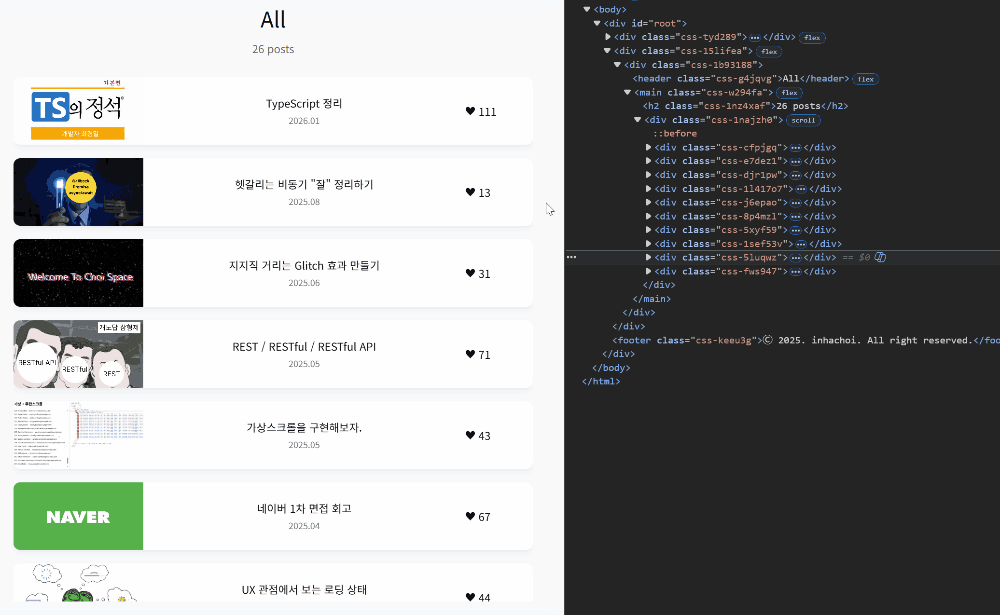

# TanStack Virtual 딥다이브

## 🍀 가상화는 왜 필요할까?

### ✏️ 문제 상황

블로그에서 특정 기술 아티클을 찾기 위해 계속 스크롤을 내리고 있다고 가정해 봅시다.

스크롤할수록 새로운 포스팅들이 로드되고, 해당하는 DOM 요소들이 계속 위에 쌓이게 됩니다. 수백, 수천 개의 DOM이 쌓이면 점점 느려지고, 느린 네트워크 환경이라면 체감은 더 클 것입니다.

그런데 위에 쌓인 DOM 요소들은 사실 필요 없습니다. **지금 화면에 보이지 않기 때문입니다.**

굳이 쌓아둘 이유가 없고, 보여야 할 순간에만 생기면 됩니다. 하지만 그때마다 API를 다시 호출하는 것도 비용이 큽니다.

**이때 데이터는 유지하되, 보이는 부분만 렌더링할 수 있게 해주는 것이 가상화입니다.**



실제 예시를 보면, 전체 아이템은 26개지만 실제로 DOM에 렌더링되는 `<div>` 요소는 10개 내외입니다. 나머지는 존재하지 않다가, 스크롤해서 화면에 들어오는 순간 생성됩니다.

---

### ✏️ TanStack Virtual은…

대규모 요소 리스트 가상화를 위한 헤드리스 UI 라이브러리입니다.

컴포넌트를 제공하지 않고, 가상화 계산만 담당합니다. 마크업과 스타일은 개발자가 100% 직접 제어합니다.

---

### ✏️ 공식문서 예시 코드

공식문서 예시 코드

```tsx
import { useVirtualizer } from "@tanstack/react-virtual";

function App() {
  // 스크롤 컨테이너로 쓸 div를 참조
  const parentRef = React.useRef(null);

  // Virtualizer 인스턴스 생성
  const rowVirtualizer = useVirtualizer({
    count: 10000, // 전체 아이템 수
    getScrollElement: () => parentRef.current, // 스크롤 감지할 컨테이너
    estimateSize: () => 35, // 아이템 높이 추정값 (px)
  });

  return (
    <>
      {/* 실제로 스크롤되는 컨테이너 */}
      <div
        ref={parentRef}
        style={{
          height: `400px`,
          overflow: "auto", // Make it scroll!
        }}
      >
        {/* 
          전체 아이템 높이만큼 공간을 잡아두는 빈 컨테이너
          이게 없으면 스크롤바가 실제보다 짧게 나옴
          실제 DOM은 10개뿐이지만 스크롤바는 10000개인 척 동작
        */}
        <div
          style={{
            height: `${rowVirtualizer.getTotalSize()}px`,
            width: "100%",
            position: "relative",
          }}
        >
          {/* 
            지금 화면에 보이는 아이템만 렌더링
            10000개 중 실제로는 10~15개 정도만 여기 들어옴
          */}
          {rowVirtualizer.getVirtualItems().map((virtualItem) => (
            <div
              key={virtualItem.key}
              style={{
                position: "absolute",
                top: 0,
                left: 0,
                width: "100%",
                height: `${virtualItem.size}px`,
                transform: `translateY(${virtualItem.start}px)`,
              }}
            >
              Row {virtualItem.index}
            </div>
          ))}
        </div>
      </div>
    </>
  );
}
```

### ✏️ 주요 옵션

**`count`** — 전체 아이템 수. 실제 데이터가 아니라 개수만 받음

**`estimateSize`** — 렌더 전 높이 추정값. 동적 높이라면 실제보다 크게 잡는 게 유리

**`overscan`** — 뷰포트 경계 밖으로 미리 렌더할 아이템 수. 기본값 `1`

**`getScrollElement`** — 스크롤 컨테이너 반환 함수

**`getItemKey`** — 아이템별 고유 key. 미설정 시 index 사용

**`lanes`** — 컬럼 수. 그리드 / 메이슨리 레이아웃에 사용

**`gap`** — 아이템 간 간격

**`enabled`** — `false`면 가상화 비활성, 전체 렌더

<br/>

## 🍀 내부적으로 어떻게 동작할까?

### ✏️ 전체 흐름

```
스크롤 이벤트 발생
  → scrollOffset 갱신
  → calculateRange() 실행
  → getVirtualItems() 반환
  → React 리렌더
```

---

### ✏️ 단계별 설명

**① 스크롤 감지**

`useVirtualizer`가 마운트되는 순간, 스크롤 컨테이너에 scroll 이벤트 리스너가 붙습니다. 사용자가 스크롤할 때마다 현재 스크롤 위치인 `scrollOffset`(= scrollTop)이 갱신됩니다.

**② 범위 계산**

갱신된 `scrollOffset`과 컨테이너 높이를 가지고 `calculateRange()`가 실행됩니다. "지금 화면에 보여야 할 첫 번째 아이템은 몇 번째고, 마지막은 몇 번째야?" 를 계산해서 `startIndex`와 `endIndex`를 구합니다.

**③ VirtualItem 배열 반환**

`getVirtualItems()`가 `startIndex` ~ `endIndex` 범위 안 아이템들의 포지션 정보를 반환합니다.

여기서 중요한 포인트는 **원본 데이터 배열을 slice하는 게 아니라는 점**입니다. TanStack Virtual은 데이터가 뭔지 모릅니다. 위치 정보만 계산해서 넘겨주고, 실제 데이터 접근은 개발자가 `items[virtualItem.index]`로 직접 합니다.

```tsx
{
  key: number | string; // 안정적인 식별자
  index: number; // 원본 배열 인덱스 → items[virtualItem.index]로 데이터 접근
  start: number; // translateY에 들어갈 top 위치값
  size: number; // 아이템 높이
}
```

**④ React 렌더**

React는 이 배열을 받아서 각 아이템을 `position: absolute` + `translateY(virtualItem.start)`로 정확한 위치에 배치합니다.

스크롤이 내려가서 범위가 바뀌면 `getVirtualItems()`가 새로운 배열을 반환합니다. React는 이전 배열과 비교해서 사라진 아이템은 DOM에서 제거하고, 새로 들어온 아이템은 마운트합니다. React diffing이 범위를 계산하는 게 아니라, 배열 자체가 교체된 결과입니다.

**⑤ 스크롤바 유지**

실제 DOM에는 아이템이 10~15개밖에 없는데, 스크롤바는 왜 10000개짜리처럼 길게 보일까요?

`getTotalSize()`가 반환하는 전체 높이만큼의 빈 컨테이너가 있기 때문입니다. 눈에 보이는 건 아무것도 없지만, 스크롤 영역을 10000개 분량만큼 차지하고 있어서 스크롤바가 정상적으로 동작합니다.

**⑥ key와 overscan**

**key** — `virtualItem.key`를 써야 합니다. `virtualItem.index`를 key로 쓰면 스크롤을 내릴 때 index가 밀리면서 React가 엉뚱한 DOM 노드를 재사용하는 버그가 생깁니다. `virtualItem.key`는 TanStack Virtual이 내부적으로 관리하는 안정적인 식별자입니다.

**overscan** — 뷰포트 경계 바로 밖의 아이템을 미리 몇 개 렌더링해두는 옵션입니다. 기본값은 `1`인데, 빠르게 스크롤할 때 아직 렌더가 안 된 영역이 잠깐 빈 화면으로 보이는 현상을 방지합니다.

<br/>

## 🍀 딥다이브 — 내부 구현 파헤치기

### ✏️ startIndex는 어떻게 찾을까 — binary search

> 스크롤할 때마다 startIndex를 찾아야 하는데, 10000개짜리 리스트에서 어떻게 빠르게 찾을 수 있을까요?

고정 높이라면 `scrollOffset / itemHeight`로 바로 구할 수 있습니다. 하지만 동적 높이에서는 나눗셈이 불가능하고, 앞에서부터 하나씩 찾으면 O(n)으로 느립니다.

`measurementsCache`는 `start` 기준으로 정렬된 배열이기 때문에 binary search가 가능합니다. 10000개여도 최대 14번만 비교하면 됩니다(O(log n)).

```tsx
// 실제 소스 (index.ts)
const findNearestBinarySearch = (low, high, getCurrentValue, value) => {
  while (low <= high) {
    const middle = ((low + high) / 2) | 0; // 중간 인덱스 (비트 연산으로 소수점 버림)
    const currentValue = getCurrentValue(middle);

    if (currentValue < value) {
      low = middle + 1;
    } // 오른쪽 반으로
    else if (currentValue > value) {
      high = middle - 1;
    } // 왼쪽 반으로
    else {
      return middle;
    } // 정확히 일치
  }
  return low > 0 ? low - 1 : 0;
};
```

`startIndex`를 찾은 뒤 `endIndex`는 `item.end > scrollOffset + 뷰포트높이`가 될 때까지 한 칸씩 앞으로 나가며 찾습니다.

---

### ✏️ measurementsCache — 각 아이템의 위치를 어떻게 아는가

> binary search를 하려면 각 아이템의 위치를 미리 알고 있어야 합니다. 그럼 렌더도 안 된 아이템의 위치를 어떻게 알고 있을까요?

처음엔 `estimateSize()`의 추정값으로 `start`, `end`를 계산해서 채워둡니다.

```tsx
const size = itemSizeCache.get(key) ?? estimateSize(i); // 실측값 없으면 추정값 사용
const end = start + size;

measurements[i] = { index: i, start, size, end, key, lane };
// ex) { index: 0, start: 0,  size: 35, end: 35  }
// ex) { index: 1, start: 35, size: 35, end: 70  }
// ex) { index: 2, start: 70, size: 40, end: 110 } ← 이 아이템만 높이가 다르면
```

아이템이 DOM에 마운트되면 ResizeObserver가 실제 높이를 측정해서 `itemSizeCache`를 업데이트하고, 변경된 인덱스부터만 재계산합니다.

뷰포트 위쪽 아이템 크기가 바뀌면 scroll offset도 같이 보정합니다. 이 처리가 없으면 위쪽 아이템 높이가 바뀔 때 화면이 갑자기 튀는 버그가 생깁니다.

---

### ✏️ 자체 memo — 왜 React.useMemo가 아닌가

> 스크롤 이벤트는 굉장히 자주 발생합니다. 그때마다 매번 재계산하면 성능에 문제가 없을까요? 그리고 왜 React.useMemo가 아닌 자체 memo를 쓸까요?

핵심 로직은 `virtual-core` 패키지에 있고, 이 패키지는 React 없이 Vue, Svelte, Solid에서도 동작해야 합니다. React에 의존하는 `useMemo`를 쓸 수 없는 이유입니다.

그래서 자체 `memo()` 유틸을 만들었습니다. 의존성이 바뀌지 않으면 이전 결과를 그대로 반환합니다.

```tsx
// 스크롤 이벤트가 발생해도
// scrollOffset이 실제로 바뀌지 않았다면 재계산하지 않음
memo(getDeps, fn, { key, debug });
```

| 메서드              | 역할                              |
| ------------------- | --------------------------------- |
| `getMeasurements()` | 각 아이템의 start, end, size 계산 |
| `calculateRange()`  | startIndex ~ endIndex 계산        |
| `getVirtualItems()` | 렌더할 VirtualItem[] 반환         |

---

### ✏️ React 어댑터는 어떻게 연결되는가

> virtual-core가 React를 전혀 모른다면, 스크롤이 바뀌었을 때 React 리렌더는 어떻게 트리거될까요?

`react-virtual`이 `Virtualizer` 클래스를 React 훅으로 감싸는 역할을 합니다.

```tsx
// react-virtual/src/index.tsx 실제 소스
function useVirtualizerBase(options) {
  // 리렌더를 강제로 트리거하는 장치
  const rerender = React.useReducer(() => ({}), {})[1];

  const resolvedOptions = {
    ...options,
    onChange: (instance, sync) => {
      if (sync) {
        flushSync(rerender);
      } // 동기 업데이트가 필요할 때
      else {
        rerender();
      } // 일반적인 경우
    },
  };

  // Virtualizer 인스턴스는 최초 1회만 생성
  const [instance] = React.useState(() => new Virtualizer(resolvedOptions));
}
```

흐름을 보면:

1. `Virtualizer` 내부에서 range가 바뀌면 `onChange` 호출
2. React가 `rerender()` 실행
3. `getVirtualItems()` 재호출 → 새 배열로 리렌더

`virtual-core`는 계산만, `react-virtual`은 React와의 연결만 담당합니다. TanStack Table의 headless 구조와 완전히 같은 패턴입니다.

<br/>

## **🤔 최종 내 느낌**

- 나도 가상화 좀 하고 싶다. 출근은 유지하되, 보이는 순간에만 생기는 걸로.
