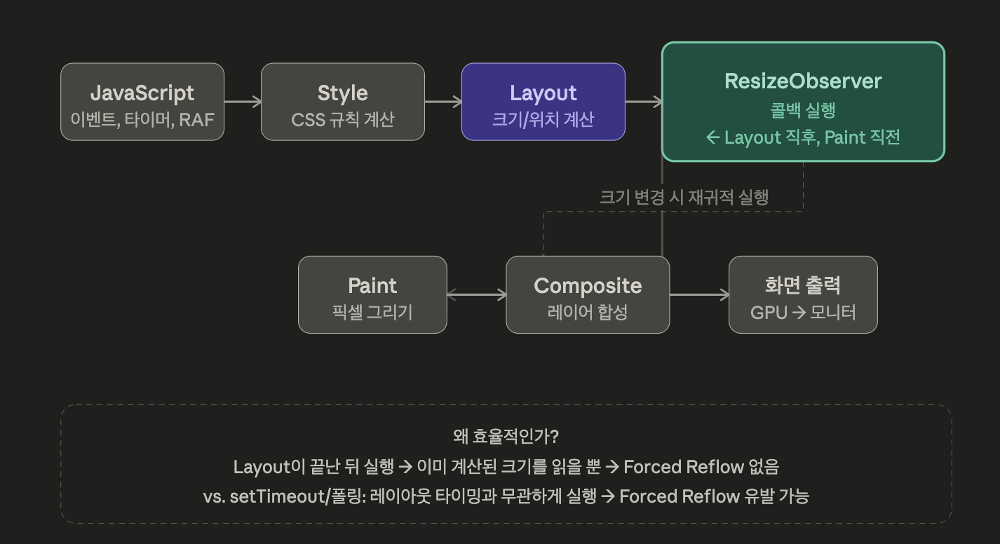

# Tanstack Virtual이란?

> 수만에서 수십만 개의 DOM 요소를 렌더링할 때 발생하는 성능 병목을 해결하기 위해 실제로 보이는 영역의 아이템만 DOM에 올리는 가상화 헤드리스 라이브러리

- 브라우저는 DOM 노드가 많아질수록 레이아웃 계산, 페인팅, 메모리 사용량이 폭발적으로 증가함
- 10,000 개의 `<tr>` 이 있는 테이블을 렌더링할 경우 사용자가 10줄만 보고 있어도 나머지 9,990개의 노드가 메모리와 렌더링 자원을 점유함

# Tanstack Virtual은 어떻게 동작하는가?

> 스크롤 이벤트를 감지해 현재 `scrollTop` 값을 기반으로 어떤 인덱스의 아이템이 뷰포트에 들어와 있는가를 이진 탐색을 통해 O(logn) 으로 계산하고, 해당 아이템만 absolute 포지션으로 정확한 위치에 배치

## ① 전체 높이 확보 (getTotalSize)

가상화의 첫 번째 트릭은 스크롤바를 속이는 것이다. 실제 아이템을 렌더링하지 않아도 스크롤바가 올바른 높이를 가져야 하기 때문에, 빈 컨테이너의 높이를 `count × estimatedItemSize` 로 설정해 브라우저에게 "이만큼의 컨텐츠가 있다"고 인식시킨다.

```plain text
getTotalSize() = Σ(모든 아이템 높이의 합)
                = 10,000개 × 50px = 500,000px (거대한 빈 공간)
```

## ② 이진 탐색으로 시작 인덱스 계산

스크롤이 발생할 때마다 `scrollTop` 을 읽어 "지금 어떤 인덱스부터 보여야 하는가"를 계산한다. 고정 높이라면 단순 나눗셈이지만, 동적 높이(dynamic size) 를 지원할 때는 각 아이템의 누적 오프셋 배열을 이진 탐색으로 순회한다.

```plain text
// 고정 높이일 때
startIndex = Math.floor(scrollTop / itemHeight)

// 동적 높이일 때 (이진 탐색)
startIndex = binarySearch(offsets, scrollTop) // O(log n)
```

## ③ absolute 포지셔닝으로 정확한 위치 배치

계산된 아이템들만 DOM에 올리고, 각 아이템의 실제 위치를 `translateY` 로 지정한다. 스크롤 위치와 무관하게 "원래 있어야 할 자리"에 정확히 그려넣는 것이 핵심이다.

```plain text
각 아이템의 translateY = 해당 아이템의 누적 오프셋 (start 값)
```

## Practical Example

```jsx
const virtualizer = useVirtualizer({
  count: messages.length,
  getScrollElement: () => parentRef.current,
  estimateSize: () => 80, // 초기 예상값 (실제 측정 후 자동 보정)
  measureElement: (el) => el?.getBoundingClientRect().height, // 실측!
  overscan: 3,
});

// 렌더링 후 실제 DOM 높이를 측정해서 오프셋 테이블 업데이트
{
  virtualizer.getVirtualItems().map((item) => (
    <div
      key={item.key}
      ref={virtualizer.measureElement} // ← 이게 핵심
      data-index={item.index}
      style={{
        position: "absolute",
        top: 0,
        transform: `translateY(${item.start}px)`,
      }}
    >
      <MessageBubble message={messages[item.index]} />
    </div>
  ));
}
```

`measureElement` 콜백이 `ResizeObserver` 를 내부적으로 연결하여, 아이템이 마운트될 때마다 실제 높이를 측정하고 오프셋 테이블을 보정한다. 이것이 동적 높이 가상화가 동작하는 핵심 원리이다.

TanStack Virtual의 진짜 가치는 렌더링을 줄이는 것이 아니라, 브라우저의 레이아웃 엔진이 처리해야 할 노드 수를 근본적으로 제한하는 것이다. 1만 개 행이 있는 테이블을 일반 렌더링으로 구현하고 나서 나중에 최적화하려는 접근보다는 처음 설계 단계에서 '이 리스트가 50개를 넘을 가능성이 있는가?'를 먼저 고려하는 것이 좋다고 한다.

# ResizeObserver, 동적 높이 측정의 핵심

## ① ResizeObserver란?

`ResizeObserver` 는 특정 DOM 요소의 크기(height, width) 변화를 비동기적으로 감지해 콜백을 호출해주는 브라우저 내장 WEB API이다.

기존 `window.resize` 이벤트가 뷰포트 전체를 감시했다면 `ResizeObserver` 는 개별 요소 단위로 감시한다.

## ② 등장 배경

과거에는 특정 요소의 크기 변화를 감지하려면 개발자들이 아래와 같이 로직을 작성해야 했음

```javascript
// 과거의 방식들 (모두 문제가 있었음)
window.addEventListener('resize', checkElementSize); // 뷰포트 리사이즈만 감지
setInterval(() => checkElementSize(), 200);          // 폴링 → CPU 낭비
element.addEventListener('animationend', ...);       // 타이밍 보장 불가
```

이런 문제를 해결하기 위해 브라우저 표준으로 등장한 것이 `ResizeObserver` 이다. 3가지 Observer API 형제 중 하나이기도 하다.

| API 이름               | 감시 대상                  | 콜백 트리거 조건                                  |
| :--------------------- | :------------------------- | :------------------------------------------------ |
| `MutationObserver`     | DOM 구조 변경              | 노드 추가/삭제, 속성 변경, 텍스트 내용 변화 등    |
| `IntersectionObserver` | 뷰포트(Viewport) 교차 여부 | 요소가 화면에 들어오거나 나갈 때 (스크롤 감시 등) |
| `ResizeObserver`       | 요소의 크기 변화           | 요소의 `width` 또는 `height`가 변경될 때          |

---

- `MutationObserver`는 주로 동적으로 생성되는 UI 요소를 감지할 때 유용
- `IntersectionObserver`는 이미지 지연 로딩(Lazy Loading)이나 무한 스크롤 구현에 최적화
- `ResizeObserver`는 브라우저 창 크기가 아닌, 특정 요소 자체의 크기 변화에 반응하므로 반응형 컴포넌트 제작 시 편리

### ResizeObserver 기본 사용 방법

```javascript
const observer = new ResizeObserver((entries) => {
  for (const entry of entries) {
    const { width, height } = entry.contentRect;
    console.log(`width: ${width}, height: ${height}`);
  }
});

observer.observe(targetElement); // 감시 시작
observer.unobserve(targetElement); // 감시 중단
observer.disconnect(); // 모든 감시 해제
```

콜백에 전달되는 `entries`는 `ResizeObserverEntry` 객체의 배열이며, 각 엔트리는 아래 정보를 담고 있다.

```javascript
entry.target; // 감시 대상 DOM 요소
entry.contentRect; // content 영역의 DOMRectReadOnly (padding 제외)
entry.borderBoxSize; // border 포함한 크기 (최신 스펙)
entry.contentBoxSize; // content 영역 크기 (최신 스펙)
```

## ③ 동작 원리

> `ResizeObserver` 는 브라우저의 렌더링 파이프라인 내 레이아웃(Layout) 단계 직후에 콜백을 실행한다. 폴링이나 이벤트 버블링 없이, 브라우저가 레이아웃을 완료한 시점에 정확히 호출되므로 추가적인 레이아웃 강제 재계산(Forced Reflow)이 없다.



브라우저 렌더링 파이프라인 (DOM생성, CSSOM생성, 렌더트리생성, 레이아웃계산, 페인팅, 컴포지팅) 중 레이아웃 계산 이후에 실행된다. 따라서 이미 계산된 크기를 읽기에 Reflow(레이아웃 다시 계산 - width height margin padding border)가 발생하지 않는다.

기존 방식을 사용한다면 레이아웃 타이밍과 무관하게 실행되어 Reflow를 유발할 수 있었다.

또한 `ResizeObserver` 에는 내부 안전장치가 존재하는데, 콜백 실행 중 다른 요소의 크기가 변경되면 그 요소도 다음 레이아웃 단계에서 처리하는 재귀적 구조가 바로 그것이다. 이때 무한 루프를 막기 위해 depth 개념을 통해 제한한다.

```plain text
Frame 시작
 ├── Layout 실행
 ├── ResizeObserver 콜백 실행 (depth 0에서 감지된 요소들)
 │    └── 콜백 중에 다른 요소 크기 변경 발생
 ├── Layout 재실행
 ├── ResizeObserver 콜백 실행 (depth 1에서 감지된 요소들 — 더 깊은 DOM 노드만)
 │    └── 더 이상 새로운 변경 없음
 └── Paint 실행
```

같은 depth에서 무한하게 서로의 크기를 변경하는 상황이 생기면 브라우저는 `ResizeObserver loop completed with undelivered notifications` 에러를 콘솔에 출력하고 해당 프레임을 중단한다.

## ④ Tanstack Virtual과의 연결고리

앞서 보았던 `measureElement` 가 내부적으로 `ResizeObserver` 를 어떻게 활용하는지 코드로 확인해보자. 아래는 Tanstack Virtual의 `measureElement` 내부 동작을 단순화한 버전이다.

```javascript
class VirtualMeasurer {
  #observer;
  #sizeCache = new Map(); // index → measured height
  #onSizeChange;

  constructor(onSizeChange) {
    this.#onSizeChange = onSizeChange;

    this.#observer = new ResizeObserver((entries) => {
      let needsUpdate = false;

      for (const entry of entries) {
        const index = Number(entry.target.dataset.index);
        // borderBoxSize가 없는 구형 브라우저를 위한 폴백
        const height =
          entry.borderBoxSize?.[0]?.blockSize ?? entry.contentRect.height;

        const prev = this.#sizeCache.get(index);
        if (prev !== height) {
          this.#sizeCache.set(index, height);
          needsUpdate = true;
        }
      }

      // 실제로 변경된 경우에만 재계산 트리거
      if (needsUpdate) this.#onSizeChange();
    });
  }

  // ref 콜백으로 사용 (TanStack의 measureElement)
  measure = (element) => {
    if (!element) return;
    this.#observer.observe(element); // 마운트 시 감시 시작
  };

  getSize(index) {
    return this.#sizeCache.get(index) ?? 50; // 기본값 50px
  }

  disconnect() {
    this.#observer.disconnect();
  }
}
```

코드를 살펴보자.

### 클래스 내부 필드 정의

| 필드            | 타입                  | 역할                                        |
| :-------------- | :-------------------- | :------------------------------------------ |
| `#observer`     | `ResizeObserver`      | 요소의 실제 크기 변화를 감지하는 인스턴스   |
| `#sizeCache`    | `Map<number, number>` | 인덱스별로 측정된 높이 값을 저장하는 저장소 |
| `#onSizeChange` | `() => void`          | 크기가 변경되었을 때 실행할 외부 콜백 함수  |

### ResizeObserver 초기화

```javascript
constructor(onSizeChange) {
  this.#onSizeChange = onSizeChange;

  this.#observer = new ResizeObserver((entries) => {
    let needsUpdate = false;

    for (const entry of entries) {
      const index = Number(entry.target.dataset.index);

      const height = entry.borderBoxSize?.[0]?.blockSize
        ?? entry.contentRect.height;

      const prev = this.#sizeCache.get(index);
      if (prev !== height) {
        this.#sizeCache.set(index, height);
        needsUpdate = true;
      }
    }

    if (needsUpdate) this.#onSizeChange();
  });
}
```

- entries 배치 처리

`ResizeObserver` 는 콜백을 한 번 호출할 때 변경된 요소 여러 개를 `entries` 배열로 한꺼번에 전달한다. 스크롤 중 동시에 10개 아이템의 높이가 변하면, 콜백이 10번 호출되는 것이 아니라 1번 호출되며 `entries` 에 10개가 담겨온다.

- `dataset.index` 로 아이템 식별

```javascript
const index = Number(entry.target.dataset.index);
```

감시 중인 DOM 요소가 몇 번째 인덱스 아이템인지를 알아야 캐시에 저장할 수 있다. 이를 위해 렌더링 시 요소에 `data-index` 속성을 심어두고, 콜백에서 읽어온다.

- `borderBoxSize` 와 폴백 처리

```javascript
const height = entry.borderBoxSize?.[0]?.blockSize ?? entry.contentRect.height;
```

`borderBoxSize` 는 padding 과 border를 포함한 요소의 실제 점유 크기로, 가상 리스트에서는 이 값이 아이템 간격 계산의 기준이 되어야 한다. 구현 브라우저의 경우 `borderBoxSize` 를 지원하지 않아 `contentRect.height` 를 폴백으로 걸어뒀다고 한다.

- `needsUpdate` 플래그를 통한 불필요한 재계산 방지

```javascript
const prev = this.#sizeCache.get(index);
if (prev !== height) {
  // 이전 값과 다를 때만
  this.#sizeCache.set(index, height);
  needsUpdate = true;
}
```

`ResizeObserver` 는 최초 `observe()` 시점에도 콜백을 한 번 호출한다. 즉 10개 아이템이 마운트되면 초기화 시점에 10번의 엔트리가 들어올 수 있다. 이때 아무것도 바뀌지 않았는데 무조건 `#onSizeChange` 를 호출하면 불필요한 리렌더링이 발생하므로, 실제로 값이 바뀐 경우에만 트리거하는 것이 이 플래그의 역할이다.

### `measure` 메서드 (`measureElement`)

```javascript
measure = (element) => {
  if (!element) return;
  this.#observer.observe(element);
};
```

화살표 함수로 선언된 클래스 필드 메서드이다. 일반 메서드(measure() {})가 아닌 화살표 함수로 선언한 데는 중요한 이유가 있는데..

```javascript
// React ref 콜백으로 사용될 때
<div ref={measurer.measure} data-index={item.index} />
```

화살표 함수를 통해 `this` 에 `VirtualMeasurer` 를 영구적으로 바인딩함으로써 `private` 한 필드인 `#observer` 에 접근할 수 있다.

```javascript
// 1단계: constructor에서 ResizeObserver를 만들어 #observer에 저장
this.#observer = new ResizeObserver((entries) => {
  // 나중에 element가 들어오면 여기가 실행될 거야
  for (const entry of entries) { ... }
});

// 2단계: measure()가 호출될 때 비로소 "이 element를 감시해줘" 라고 등록
measure = (element) => {
  this.#observer.observe(element); // ← 여기서 연결!
};
```

- new ResizeObserver(콜백)은 크기 변화를 감지하면 이 콜백을 실행할 감시자를 만든 것
- observe(element)는 그 감시자한테 "이 element를 감시 목록에 추가해줘" 라고 지시하는 것

```javascript
observer.observe(elementA); // elementA 감시 시작
observer.observe(elementB); // elementB도 추가
observer.observe(elementC); // elementC도 추가

// 이제 A, B, C 중 하나라도 크기가 바뀌면
// 콜백의 entries 배열에 담겨서 한꺼번에 옴
```

### 전체 흐름 요약

```plain text
[마운트]
  React가 <div ref={measurer.measure} data-index={i} /> 렌더링
    → measure(element) 호출
    → observer.observe(element) 등록
    → ResizeObserver가 즉시 콜백 호출 (초기 측정)
    → #sizeCache에 실측 높이 저장
    → #onSizeChange() → 가상화 엔진 오프셋 재계산

[크기 변경 (예: 이미지 로드, 텍스트 증가)]
  브라우저 Layout 완료
    → ResizeObserver 콜백 실행
    → 이전 값과 다르면 캐시 업데이트
    → #onSizeChange() → 오프셋 재계산 → 리렌더링

[언마운트]
  measurer.disconnect() → 모든 감시 해제 → 메모리 해방
```
