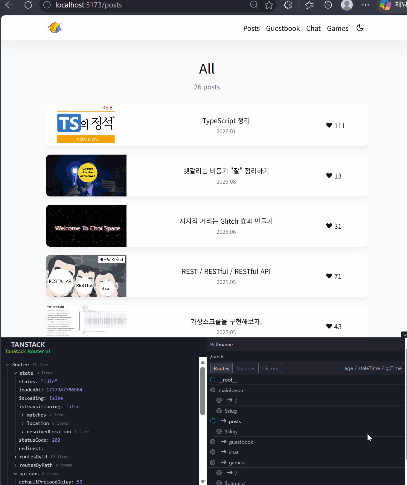

# TanStack Intent 딥다이브

## TanStack Intent란?

**npm 패키지 안에 AI 에이전트용 학습 자료(SKILL.md)를 심어서 배포하는 CLI 도구.**

2026년 3월 4일 TanStack 팀이 발표한 alpha 도구로, `@tanstack/intent`로 설치한다.

에이전트(Claude Code, Cursor 등)가 라이브러리를 쓸 때 올바른 버전 기준의 패턴을 알고 코드를 생성하도록 돕는다.

<br/>

## 1️⃣ 왜 만들었나

TanStack 팀이 짚은 문제는 이거다.

> "Your docs are good. Your types are solid. Your agent still gets it wrong."

AI 에이전트가 라이브러리를 잘못 쓰는 이유는 세 가지다.

- **문서는 사람용이다** — 에이전트가 소비하기엔 노이즈가 많다
- **타입은 개별 API만 검증한다** — "언제 어떤 패턴을 써야 하는지"는 인코딩하지 못한다
- **학습 데이터는 특정 시점에 고정된다** — breaking change가 배포돼도 모델은 업데이트되지 않아 구 API와 신 API가 확률적으로 섞인 상태가 영구히 유지된다 (TanStack 팀은 이걸 **"permanent split-brain"** 이라고 불렀다)

기존 대안도 불편했다. TanStack Router 사용법을 에이전트에게 가르치려면 커뮤니티가 GitHub에 올린 rules 파일을 직접 찾아서 `.cursorrules`나 `CLAUDE.md`에 복붙해야 했다. Query는 따로, Router는 따로 — 각각 다른 위치, 다른 저자, 다른 시점.

**Intent는 이 전달 채널을 npm으로 통합했다.**

<br/>

## 2️⃣ 동작 방식

### SKILL.md가 뭔가

**라이브러리 메인테이너**가 작성해서 npm 패키지 안에 넣어 배포하는 마크다운 파일이다.

```
node_modules/@tanstack/router-core/
└── skills/
    ├── navigation/
    │   └── SKILL.md    ← TanStack 팀이 작성해서 넣어둔 것
    ├── search-params/
    │   └── SKILL.md
    └── ...
```

`npm install @tanstack/router`(또는 `pnpm add`) 하면 코드와 함께 딸려온다. 개발자가 직접 작성할 필요 없다.

SKILL.md 안에는 이런 내용이 들어간다.

- 올바른 패턴 / 안티패턴
- 어떤 목적에 어떤 패턴을 써야 하는지 의사결정 기준
- 메인테이너만 아는 엣지 케이스

### 개발자 사용 흐름

```bash
# 1. 패키지 설치 (SKILL.md도 함께 딸려옴)
pnpm add @tanstack/react-router

# 2. Intent 연결 (최초 1회)
pnpm dlx @tanstack/intent install
```

`install` 명령어가 하는 일:

- `node_modules` 스캔 → Intent 지원 패키지 발견
- 기존 설정 파일 확인 (`CLAUDE.md`, `.cursorrules`, `AGENTS.md` 순)
- 없으면 `AGENTS.md`를 기본으로 새로 생성
- 아래 블록을 파일에 추가

```markdown
<!-- intent-skills:start -->

## Skill Loading

Before substantial work:

- Skill check: run `npx @tanstack/intent@latest list`, or use skills already listed in context.
- Skill guidance: if one local skill clearly matches the task, run `npx @tanstack/intent@latest load <package>#<skill>` and follow the returned `SKILL.md`.
<!-- intent-skills:end -->
```

에이전트는 이 지시문을 읽고 작업 전에 스스로 관련 SKILL.md를 로드한다.

### 패키지 업데이트 시

```bash
pnpm update @tanstack/react-router
```

패키지 안의 SKILL.md도 함께 업데이트된다. **별도 작업 없음.**
새 패키지를 추가할 때만 `pnpm dlx @tanstack/intent install`을 다시 돌리면 된다.

<br/>

## 3️⃣ 26년 4월 기준 지원 현황

Intent 레지스트리에는 현재 109개 패키지, 380개 스킬이 등록돼 있다.

**TanStack 공식 패키지 중 SKILL.md 지원 목록 (26년 4월 기준)**

| 패키지                          | 스킬 수 | 비고                                               |
| ------------------------------- | ------- | -------------------------------------------------- |
| `@tanstack/router-core`         | 10개    | navigation, search-params, auth, code-splitting 등 |
| `@tanstack/router-plugin`       | 1개     | Vite 플러그인 설정                                 |
| `@tanstack/virtual-file-routes` | 1개     | 가상 파일 라우트                                   |
| `@tanstack/react-start`         | 3개     | SSR 프레임워크                                     |
| `@tanstack/db`                  | 7개     | TanStack DB (최초 지원 시작)                       |
| `@tanstack/ai`                  | 9개     | TanStack AI                                        |
| `@tanstack/cli`                 | 5개     | CLI 도구                                           |

**아직 미지원 (26년 4월 기준)**

- `@tanstack/react-query` — 가장 많이 쓰이는 라이브러리임에도 미지원
- `@tanstack/react-table`
- `@tanstack/react-virtual`
- `@tanstack/react-form`

TanStack 팀은 "TanStack DB를 시작으로 다른 라이브러리도 순차 적용 예정"이라고 밝혔다. Intent가 2026년 3월에 alpha로 발표된 만큼 아직 전체 생태계 커버가 되지 않은 상태다.

---

## 4️⃣ 내 블로그 사이트에 직접 적용한 사례

### 배경

TanStack 딥다이브 스터디에서 공부한 내용을 실제로 써보고 싶었다. 기존 블로그 사이트는 React Router로 라우팅이 구성돼 있었고, 외부 블로그(velog) 포스팅 카드를 클릭했을 때 모달로 보여주는 UX를 구현하면서 TanStack Router + Intent를 함께 적용했다.



### 작업 내용

**React Router → TanStack Router 마이그레이션**

라우트 구조를 TanStack Router의 파일 기반 라우팅으로 교체했다. FSD 아키텍처를 유지하기 위해 `routes/` 폴더는 URL 구조 정의만 담는 얇은 파일로 유지하고, 실제 컴포넌트는 `pages/` 레이어에 그대로 뒀다.

**중첩 라우팅으로 모달 UX 구현**

```
/           ← 메인 페이지 (포스팅 목록)
/$slug      ← 포스팅 모달 (메인 페이지 위에 오버레이)
/posts/$slug ← 포스팅 직접 접근 URL
```

- 카드 클릭 → URL이 `/$slug`로 변경되면서 모달 오픈
- 브라우저 뒤로가기 → 모달 닫히고 메인 페이지 복귀
- URL 복사 후 새 탭 → 모달이 열린 상태로 로딩
- velog 링크 마지막 세그먼트를 slug로 추출하는 `linkToSlug` 헬퍼 추가
- pathless 레이아웃 라우트(`mainLayoutRoute`) 도입으로 `/$slug` 매칭 문제 해결

### Intent 적용 과정과 느낀 점

**설치**

```bash
pnpm add @tanstack/react-router
pnpm dlx @tanstack/intent install
```

설치하면 `AGENTS.md`(기존 파일 없을 경우 기본값)에 Skill Loading 블록이 자동 생성됐다.

**초기 인식 문제**

처음에는 에이전트가 SKILL.md를 잘 읽지 않고 그냥 작업하는 경우가 있었다. 이를 해결하려고 `--map` 옵션을 써봤다.

```bash
pnpm dlx @tanstack/intent@latest install --map
```

`--map`은 현재 프로젝트에 설치된 TanStack 패키지 기준으로 task-to-skill 매핑을 명시적으로 AGENTS.md에 추가해준다.

```yaml
skills:
  - when: "route masking, mask option, createRouteMask..."
    use: "@tanstack/router-core#router-core/not-found-and-errors"
  - when: "Link, useNavigate, preloading..."
    use: "@tanstack/router-core#router-core/navigation"
  ...
```

에이전트가 요청 내용과 `when` 설명을 매칭해서 해당 SKILL.md를 자동으로 로드하는 방식이라 더 확실하게 동작했다.

**다시 기본 방식으로 복귀**

`--map`은 명시적이라 좋은데 단점이 있다. 나중에 새 TanStack 패키지를 추가할 때마다 `install --map`을 다시 돌려야 한다. 프로젝트가 성장하면 번거로워질 수 있어서 기본 방식으로 돌아갔다. 기본 방식은 에이전트가 `list` 명령어로 직접 스캔하니까 새 패키지 추가해도 자동으로 잡힌다.

<br/>

## 🤔 최종 내 느낌

- 아직 짜치지만... 없는 것보다는 나음 

<br/>

## ❓ 내 질문

- 여러분은 intent 써보셨을때 에이전트가 SKILL.md를 잘 인식하셨는지 궁금합니당
- 다른 사용 꿀팁 있는지 궁금합니당
